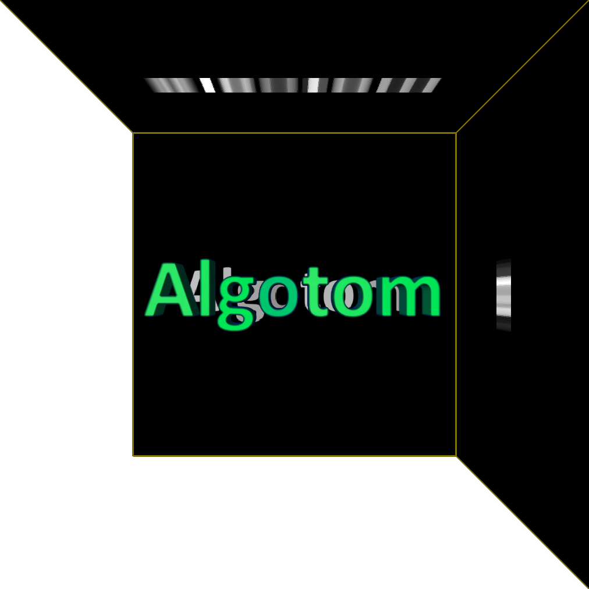

=======
Algotom
=======

Data processing (**ALGO**)rithms for (**TOM**)ography

**Algotom** is a Python package implementing methods for processing tomographic
data acquired by non-standard scanning techniques such as grid scans, helical 
scans, half-acquisition scans, or their combinations. Certainly, Algotom can 
also be used for standard scans. The software includes methods in a full 
pipeline of data processing: reading-writing data, pre-processing, tomographic 
reconstruction, post-processing, and data simulation. Many utility methods are 
provided to help users quickly develop prototype-methods or build a pipeline for
processing their own data. From version 1.1, methods for speckle-based phase-contrast
tomography were added to the package.

The software is made available for the paper in :cite:`Vo:21`.

**Source Code:** https://github.com/algotom/algotom

Content
-------

.. toctree::
   :maxdepth: 1

   features
   install
   usage
   api
   highlights
   credits
