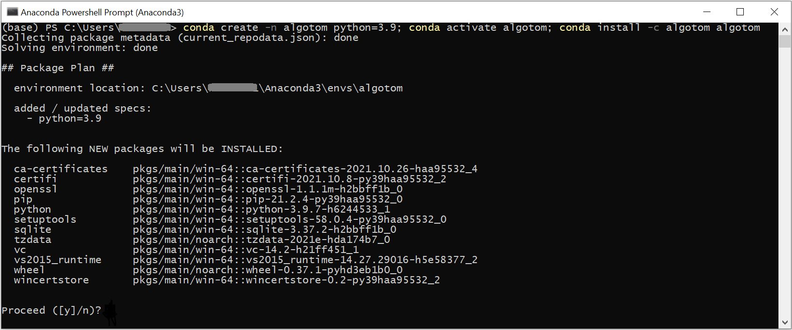
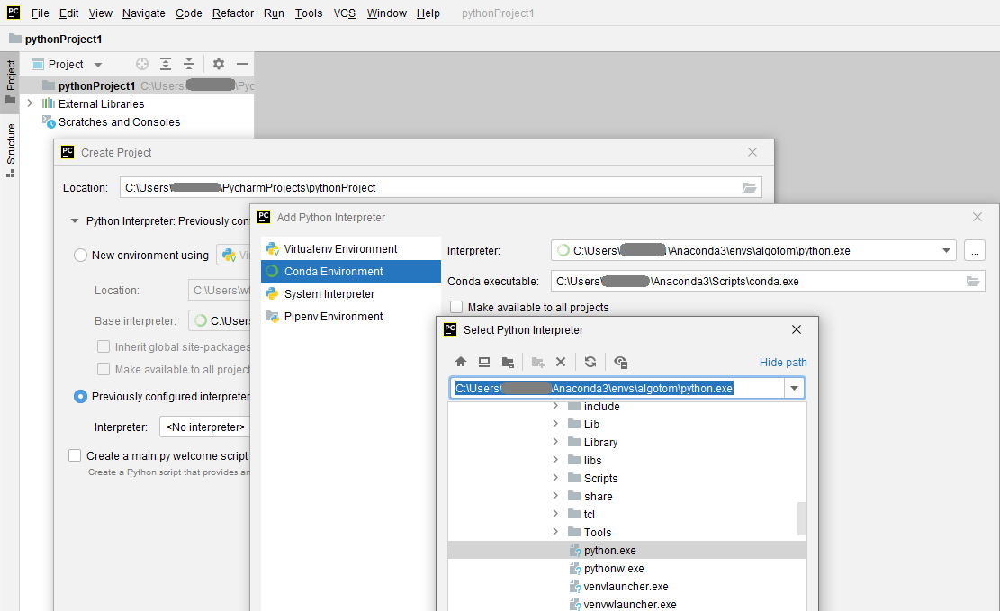

.. _section1_1:

Python for tomography scientists as beginners
=============================================

It is common that well-made software cannot provide all the tools for scientists
to perform their analysis. In such cases, knowing how to program becomes crucial.
There are many open-source programming languages to choose, in which Python and its rich
ecosystem are dominantly used in the science community for its ease-of-use. This section
dedicates to whom would like to write Python codes to process their data but
don't know where to start. There are many ways/resources to install/learn Python,
however, the section focuses to present approaches which are easy-to-follow and practical.

Installing Python and tools for writing codes
---------------------------------------------

To start, users need to install two software: one is Python and one is for
writing codes, known as IDE (Integrated Development Environment) software.
The second one is optional but it's important for coding and debugging efficiently.
Python can be downloaded and installed through `Anaconda <https://www.anaconda.com/products/individual>`__
which not only distributes Python and its ecosystem but also `Conda <https://docs.conda.io/projects/conda/en/latest/user-guide/install/download.html>`__,
a package management software, to install Python libraries with easy. These open-source
libraries, contributed by the developer community, are the main reason for the
popularity of Python.

After installing Anaconda, users can run Anaconda Powershell Prompt (e.g. on WinOS)
to manage and install Python packages (i.e. libraries). A collection of Python
packages installed is known as an environment. An environment created by a
package manager (e.g. Conda) helps to deal with the conflict of Python packages
using different versions of dependencies. This `link <https://www.freecodecamp.org/news/why-you-need-python-environments-and-how-to-manage-them-with-conda-85f155f4353c/>`__
is useful for whom want to know more about Python environment. There is a
`list <https://docs.anaconda.com/anaconda/packages/pkg-docs/>`__ of popular
Python libraries shipped with Anaconda, known as the *base* environment. To install
Python packages out of the list, it's a good practice that users should create a
separate environment from the base. Instructions of how to create a new environment
and how to install new packages are `here <https://docs.conda.io/projects/conda/en/latest/user-guide/tasks/manage-environments.html>`__
and `here <https://docs.conda.io/projects/conda/en/latest/user-guide/tasks/manage-pkgs.html>`__.

    Combination of conda commands to: create an environment named algotom, install
    Python 3.9, activate the environment, then install the algotom package from
    the `algotom channel <https://anaconda.org/algotom>`__.

The next step is to install an IDE software for writing codes. There are many free
choices: `Pycharm (Community edition) <https://www.jetbrains.com/pycharm/download/>`__,
Pydev, Spyder, or VS Code. Here, we recommend to use Pycharm because it is
charming as the name suggested. After installing Pycharm, users have to configure the
software to link to a Python interpreter by pointing to the location of Python
packages installed (:numref:`fig_1_1_2`).

    Demonstration of how to configure Pycharm to link to a Python environment.

Python ecosystem of libraries
-----------------------------

The power and popularity of Python come from its enormous ecosystem. Crucially,
supporting tools such as Conda, Pip, and Github make it very easy for developers/users
to develop/install Python libraries. Nowadays, imaging scientists can use Python
libraries to perform almost every task in the workflow from data acquisition,
data processing, data analysis, to data visualization. Python libraries can be
classified into a few types. The first one is `the standard library <https://docs.python.org/3/library/>`__,
i.e. the built-in packages. They are shipped with Python. The second type is well-developed
and popular libraries maintained by dedicated software development teams. List of
such libraries can be found in this `link <https://docs.anaconda.com/anaconda/packages/pkg-docs/>`__
which are shipped with `Anaconda software <https://www.anaconda.com/products/individual>`__.
The third type are libraries developed by organizations, academic institutions, or research groups
dedicated to specific technical/scientific areas. The last type of libraries
is contributed by individuals who would like to share their works.

A Python package is commonly built based on other Python libraries known as *dependencies*.
This can cause conflicts between libraries using different versions of the same
libraries. In such cases, a package manager like Conda is crucially needed.
Python libraries are distributed through https://anaconda.org/ and https://pypi.org/.
Users can search packages they need in these websites where instructions of
how to install these packages using the *conda* or *pip* command are shown on
the page of each package. Lots of Python packages are distributed on both platforms.
However, there are packages only available in one platform. Fortunately, Conda allows
to use *pip* to install packages as well. Users are recommended to check this `tutorial <https://www.freecodecamp.org/news/why-you-need-python-environments-and-how-to-manage-them-with-conda-85f155f4353c/>`__
to know more about the difference between *conda* and *pip*.

The following list shows some Python packages which are useful for the tomography
community. The selected packages are installable using *conda/pip* and work across
OS (Windows, Linux, Mac).

- Numerical computing: Numpy, Scipy, Pyfftw, Pywavelets, ...
- Image processing: Scikit-image, Pillow, Discorpy, Opencv, ...
- Tomographic data processing: Tomopy, Astra Toolbox, Algotom, Cil, ...
- GPU computing: Numba, Cupy, ...
- Hdf file handling: H5py
- Data visualisation: Matplotlib, Vtk, ...
- Parallel processing: Joblib, Dask, ...

There are other Python software for processing tomographic data such as Savu,
Tigre, tofu-ufo, or Pyhst2. However, they either don't work across OS or are not
distributed with *conda/pip*.

Where/how to start coding
-------------------------

Python is the programming language that one can learn easily using the top-down
approach instead of the bottom-up one which takes time. For example, one can
start by asking questions such as: how to read an image, apply a smoothing
filter, and save the result; then finding the answers using Google, `Stackoverflow <https://stackoverflow.com/search?q=how+to+read+an+image+Python>`__,
or referring codes shared on `Github <https://github.com/>`__. The following presents
notes and tips about Python users may find useful before diving into coding.

-   For quickly getting to know the syntax of the Python language, the `python-course.eu
    website <https://python-course.eu/python-tutorial/structuring-indentation.php>`__
    is a good place to start.

-   In computational applications, we don't often use the standard library of
    Python but the `Numpy <https://numpy.org/doc/stable/reference/routines.html>`__ library.
    Almost all of computational Python-libraries are built on top of Numpy. Although
    it is a backbone for the success of Python, Numpy is not included into the standard
    library of Python. Users have to install it separately, or they can just install
    a package which has Numpy as a dependency. The following codes show
    an example of how to find the sum of a list of float numbers using both
    approaches: the standard library and Numpy. A rule of thumb is to avoid
    using the standard library for computational works which use looping
    operations. Numpy provides most of basic tools, optimized for speed,
    to perform math operations on n-dimension arrays. Users can build complex
    applications on top of these tools.

    .. code-block:: python

        import numpy as np

        vals = [1.0, 3.0, 5.0, 7.0, 8.0]
        # Using the standard lib
        sum = 0.0
        for i in vals:
            sum = sum + i
        # Using Numpy
        sum = np.sum(np.asarray(vals))

-   Functions (known as methods) in each Python library is organized into folders,
    sub-folders (known as packages), then Python files (known as modules). Users
    can use functions needed by importing a whole package, specific sub-packages,
    specific modules, or specific methods.

    .. code-block:: python

        import scipy  # Load the whole package
        from scipy import ndimage as ndi # Import sub-package, give it an alias name.
        import scipy.ndimage as ndi # Another way to import sub-packge.
        import scipy.ndimage.filters as fil # Import a module, give it an alias name.
        from scipy.ndimage.filters import gaussian_filter # Import a specific method in a module.

    Because Python libraries are a huge collection of functions, users better use
    the help of IDE software to find the right functions as demonstrated in
    :numref:`fig_1_1_3`. Using alias names for importing packages is a good
    practice to avoid the naming conflict, i.e. a user-defined function is named
    the same as a function in the library.

    .. figure:: section1_1/figs/fig_1_1_3.png
        :name: fig_1_1_3
        :figwidth: 90 %
        :align: center
        :figclass: align-center

        Demonstration of how Pycharm can help to see a list of available functions.

-   There are n-dimension array objects created by different Python libraries
    which look similar but their properties and uses are different. Users have
    to make sure that they use the right methods on the right objects.

    .. code-block:: python

        import numpy as np
        import dask.array as da
        import cupy as cp

        data = [[1.0, 2.0, 3.0], [3.0, 4.0, 5.0]] # Python-list object
        data_np = np.asarray(data) # Numpy-array object
        data_da = da.from_array(data_np) # Dask-array object
        data_cp = cp.array(data) # Cupy-array object

-   To use functions from Python packages in a script, users use the *import* command
    as shown above. When the command is executed, the Python interpreter automatically
    checks a few places to find such packages: paths in the system environment
    variables (e.g. WinOS: "Edit the system environment variables"
    -> "Environment variable"), paths in the current Python environment
    (e.g. WinOS: "C:\Users\<user_ID>\Anaconda3\envs\<env_name>"), and the current location
    of the script. If the import fails, users need to check: if the package is
    installed (e.g. using `conda list` in an activated environment) and/or if
    the package is at the same path as the script.

    In Pycharm, if a package keeps
    `failing to import <https://intellij-support.jetbrains.com/hc/en-us/articles/360010202240-PyCharm-can-t-install-import-a-package-library-module#:~:text=Troubleshooting%3A,and%20then%20do%20the%20test.>`__
    , even though the package is installed and the Pycharm project is
    configured to the right Python environment, users can try one of the following ways:

        +   Run `conda init`.
        +   Run Pycharm from the activated environment (e.g Win OS: Powershell Prompt -> conda activate <env_name> -> pycharm)

    If users want to add the path to a package manually, they can do that as follows.

    .. code-block:: python

        import sys
        sys.path.insert(0, "C:/<Path-to-package>")
        import <package-name>

    this is handy when users download a Python package somewhere and want to import
    its functions to the current script without installing the package. Note
    that Python libs (dependencies) used by the package need to be installed.

-   Video tutorials are the best resources to learn new things quickly. There are
    many amazing tutorials on Youtube.com (free), Udemy.com (not free but at
    affordable price). They teach nearly everything about Python and its ecosystem.
    For tomography scientists, the `youtube channel <https://www.youtube.com/c/DigitalSreeni/playlists>`__
    of Dr. Sreenivas Bhattiprolu is highly recommended. The uploaded tutorials
    accompanied by `Python codes <https://github.com/bnsreenu/python_for_microscopists>`__
    cover from `basic topics of image processing <https://www.youtube.com/playlist?list=PLHae9ggVvqPgyRQQOtENr6hK0m1UquGaG>`__
    to advanced topics such as `image segmentation and deep-learning <https://www.youtube.com/c/DigitalSreeni/playlists>`__.