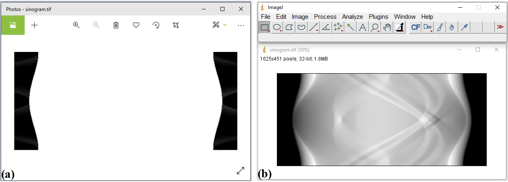

Common data format at synchrotron facilities
============================================

Two types of data format often used at most of synchrotron facilities are
tiff and hdf. Hdf (`Hierarchical Data Format <https://www.hdfgroup.org/solutions/hdf5/>`__)
format allows to store multiple data-sets, multiple data-types in a single file.
This solves a practical problem of collecting all data associated with an experiment
such as images from a detector, stage positions, or furnace temperatures into
one place for easy of management. More than that, hdf format allows to read/write
subsets of data to memory/disk. This capability enables to process a large size
dataset using a normal computer. Tiff format is used because it is
supported by most of image-related software and it can store 32-bit grayscale
values.

.. _hdf_format:

Hdf format
----------

**How to view the structure of a hdf file**

    To work with a hdf file, we need to know its structure or how to access
    its contents. This can be done using a lightweight software such as
    `Hdfview <https://portal.hdfgroup.org/display/support/Download+HDFView>`__
    (:numref:`fig_1_2_1`). Version 2.14 seems stable and is easy-to-install for WinOS.
    List of other hdf-viewer software can be found in this
    `link <https://www.hdfeos.org/software/tool.php>`__. A wrapper of the
    hdf format known as the `nexus <https://www.nexusformat.org/>`__ format
    is commonly used at neutron, X-ray, and muon science facilities. We can use
    the same software and Python libraries to access both hdf and nxs files.

    .. figure:: section1_2/figs/fig_1_2_1.png
        :name: fig_1_2_1
        :figwidth: 90 %
        :align: center
        :figclass: align-center

        Viewing the structure of a nxs/hdf file using the Hdfview software.

    Another way to display a tree view of a hdf/nxs file is to use an Algotom's
    function as shown below.

    .. figure:: section1_2/figs/fig_1_2_2.png
        :name: fig_1_2_2
        :figwidth: 90 %
        :align: center
        :figclass: align-center

        Displaying the tree view of a nxs/hdf file using an Algotom's function.

**How to load datasets from a hdf file**

    Utilities for accessing a hdf/nxs file in Python are available in the `h5py <https://docs.h5py.org/>`__
    library. To load/read a dataset to a Python workspace, we need a key, or path, to
    that dataset in a hdf/nxs file.

    .. code-block:: python
        :emphasize-lines: 8

        import h5py

        file_path = "E:/Tomo_data/68067.nxs" # https://doi.org/10.5281/zenodo.1443568
        hdf_object = h5py.File(file_path, 'r')
        key = "entry1/tomo_entry/data/data"
        tomo_data = hdf_object[key]
        print("Shape of tomo-data: {}".format(tomo_data.shape))
        #>> Shape of tomo-data: (1861, 2160, 2560)

    An important feature of a hdf format is that we can load subsets of data as
    demonstrated below.

    .. code-block:: python
        :emphasize-lines: 7, 13

        import psutil

        mem_start = psutil.Process().memory_info().rss / (1024 * 1024)
        projection = tomo_data[100, :, :]
        mem_stop = psutil.Process().memory_info().rss / (1024 * 1024)
        print("Memory used for loading 1 projection : {} MB".format(mem_stop - mem_start))
        #>> Memory used for loading 1 projection : 11.3828125 MB

        mem_start = psutil.Process().memory_info().rss / (1024 * 1024)
        projections = tomo_data[102:104, :, :]
        mem_stop = psutil.Process().memory_info().rss / (1024 * 1024)
        print("Memory used for loading 2 projections : {} MB".format(mem_stop - mem_start))
        #>> Memory used for loading 2 projections : 21.09765625 MB

    Using functions of h5py's library directly is quite inconvenient. `Algotom's API <https://algotom.readthedocs.io/en/latest/api/algotom.io.loadersaver.html>`__
    provides wrappers for these functions to make them more easy-to-use. Users can load hdf
    files, find keys to datasets, or save data in the hdf format by using a single
    line of code.

    .. code-block:: python

        import algotom.io.loadersaver as losa

        file_path = "E:/Tomo_data/68067.nxs"
        keys = losa.find_hdf_key(file_path, "data")[0] # Find keys having "data" in the path.
        print(keys)
        tomo_data = losa.load_hdf(file_path, keys[0]) # Load a dataset object
        print(tomo_data.shape)

**Notes on working with a hdf file**

    When working with multiple slices of a 3d data, it's faster to load them into
    memory chunk-by-chunk then process each slice, instead of loading and processing
    slice-by-slice. Demonstration is as follows.

    .. code-block:: python
        :emphasize-lines: 15, 24

        import timeit
        import scipy.ndimage as ndi
        import algotom.io.loadersaver as losa

        file_path = "E:/Tomo_data/68067.nxs"
        tomo_data = losa.load_hdf(file_path, "entry1/tomo_entry/data/data")
        chunk = 16

        t_start = timeit.default_timer()
        for i in range(1000, 1000 + chunk):
            mat = tomo_data[:, i, :]
            mat = ndi.gaussian_filter(mat, 11)
        t_stop = timeit.default_timer()
        print("Time cost if loading and processing each slice: {}".format(t_stop - t_start))
        #>> Time cost if loading and processing each slice: 10.171918900000001

        t_start = timeit.default_timer()
        mat_chunk = tomo_data[:, 1000:1000 + chunk, :]  # Load 16 slices in one go.
        for i in range(chunk):
            mat = mat_chunk[i]
            mat = ndi.gaussian_filter(mat, 11)
        t_stop = timeit.default_timer()
        print("Time cost if loading multiple-slices: {}".format(t_stop - t_start))
        #>>Time cost if loading multiple-slices: 0.10050070000000133

    Parallel loading datasets from a hdf file is `possible <https://docs.h5py.org/en/stable/mpi.html>`__.
    However, this feature may be not enabled for WinOS.
    When working with large datasets using a small RAM computer, we may have to
    write/read intermediate results to/from disk as hdf files. In such cases, it
    is worth to check `tutorials <https://docs.h5py.org/en/stable/high/dataset.html?highlight=chunking#chunked-storage>`__
    on how to optimize hdf I/O performance.

Tiff format
-----------

This is a very popular file format and supported by most of image-related software.
There are 8-bit, 16-bit, and 32-bit format. 8-bit format can store grayscale
values as 8-bit unsigned integers (range of 0 to 255 = 2 :superscript:`8` - 1).
16-bit format can store unsigned integers in the range of 0 to 65535
(2 :superscript:`16` - 1). 32-bit format is used to store 32-bit float data.
Most of image viewer software can display a 8-bit or 16-bit, but not 32-bit tiff
image. Users may see a black or white image if opening a 32-bit tiff image using
common photo viewer software. In such cases, `Imagej <https://imagej.nih.gov/ij/download.html>`__
or `Fiji <https://imagej.net/software/fiji/downloads>`__ software can be used.

    Opening a 32-tiff image using Photos software (a) and Imagej software (b).

Sometimes users may want to extract a 2D slice of 3D tomographic data and
save the result as a tiff image for checking using ImageJ or photo viewer
software. This can be done as shown below.

.. code-block:: python

    import algotom.io.loadersaver as losa

    file_path = "E:/Tomo_data/68067.nxs"
    tomo_data = losa.load_hdf(file_path, "entry1/tomo_entry/data/data")
    losa.save_image("E:/Tomo_data/Output/proj.tif", tomo_data[100, :, :])

If tomographic data are acquired as a list of tiff files, it can be useful to
convert them to a single hdf file first. This allows to extract subsets of
the converted data for reconstructing a few slices or tweaking artifact
removal methods before performing full reconstruction.

.. code-block:: python

    import numpy as np
    import algotom.io.loadersaver as losa

    proj_path = "E:/Tomo_data/68067/projections/"
    flat_path = "E:/Tomo_data/68067/flats/"
    dark_path = "E:/Tomo_data/68067/darks/"
    output_file = "E:/Tomo_data/68067/tomo_68067.hdf"

    # Load flat images, average them.
    flat_path = losa.find_file(flat_path + "/*.tif*")
    height, width = np.shape(losa.load_image(flat_path[0]))
    num_flat = len(flat_path)
    flat = np.zeros((num_flat, height, width), dtype=np.float32)
    for i in range(num_flat):
        flat[i] = losa.load_image(flat_path[i])
    flat = np.mean(flat, axis=0)

    # Load dark images, average them.
    dark_path = losa.find_file(dark_path + "/*.tif*")
    num_dark = len(dark_path)
    dark = np.zeros((num_dark, height, width), dtype=np.float32)
    for i in range(num_dark):
        dark[i] = losa.load_image(dark_path[i])
    dark = np.mean(dark, axis=0)

    # Generate angles
    num_angle = len(losa.find_file(proj_path + "/*.tif*"))
    angles = np.linspace(0.0, 180.0, num_angle)
    # Save tiffs as a single hdf file.
    losa.convert_tif_to_hdf(proj_path, output_file, key_path="entry/projection",
                            option={"entry/flat": np.float32(flat),
                                    "entry/dark": np.float32(dark),
                                    "entry/rotation_angle": np.float32(angles)})

Reconstructed slices from tomographic data are of 32-bit data, which often
saved as 32-bit tiff images for easy to work with using analysis software
such as `Avizo <https://www.thermofisher.com/uk/en/home/electron-microscopy/products/software-em-3d-vis/3d-visualization-analysis-software.html>`__,
`Dragon Fly <https://www.theobjects.com/dragonfly/get-non-commercial-licensing-program.html>`__,
or `Paraview <https://www.paraview.org/download/>`__. Some of these software may not
support 32-bit tiff images or the 32-bit data volume is too big for computer memory. In
such cases, we can rescale these images to 8-bit tiffs or 16-bit tiffs.  It is
important to be aware that rescaling causes information loss. The global extrema
or user-chosen percentile of a 3D dataset or 4D dataset (time-series tomography)
need to be used for rescaling to limit the loss. This functionality is available
in Algotom as demonstrated below. Users can refer to Algotom's API to know how
data are rescaled to lower bits.

.. code-block:: python

    import algotom.post.postprocessing as post

    file_path = "E:/Tomo_data/recon_68067.hdf"
    output_path = "E:/Tomo_data/rescale_8_bit/"
    post.rescale_dataset(file_path, output_path, nbit=8, minmax=None)
