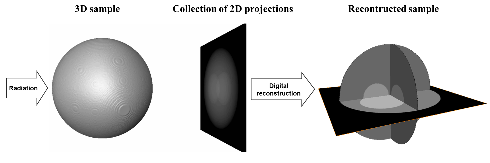
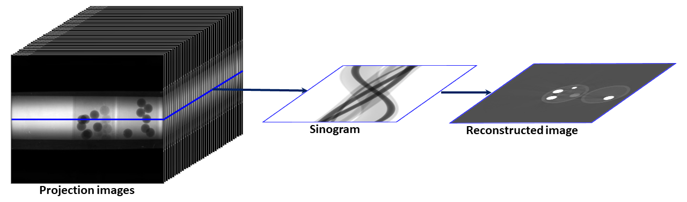
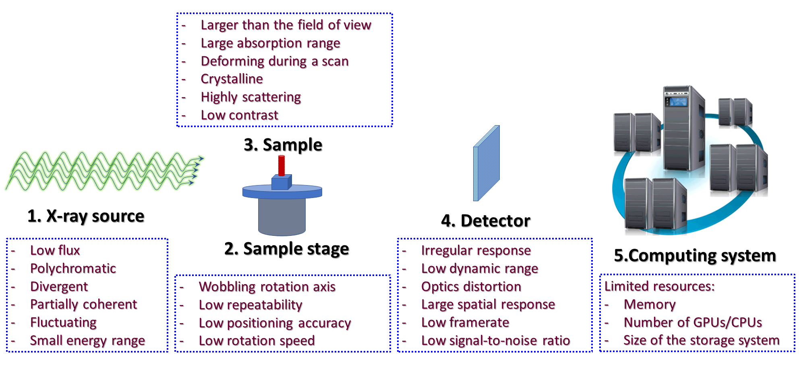

Basic components of an X-ray tomography system
==============================================

How tomography works
--------------------

As demonstrated above, tomography is an imaging technique by which the
internal 3D structure of a	sample can be reconstructed from 2D projections
formed by the penetration of radiation through the sample at a series of
different angles in the range of [0; 180-degree]. If the radiation rays are
parallel, the obtained 2D projections can be separated into independent
1D-projection rows. The sequence of these rows throughout the angular
projection range forms a sinogram, i.e. a 2D data array corresponding to each
individual row. Applying a reconstruction method on an individual sinogram
yields a reconstructed 2D slice of the sample (:numref:`fig_1_3_1`). Combining
all slices creates the 3D image of the sample.

   Steps for reconstructing a slice in parallel-beam tomography.

Basic components of an X-ray tomography system
----------------------------------------------

   Basic components of an X-ray tomography system and problems associated with them.

X-ray source
++++++++++++

	An ideal X-ray source for tomography experiments is monochromatic, stable,
	non-coherent, energy-tunable, high flux, and generates parallel beams. This
	allows to produce projections of a sample closest to the prediction of a
	mathematical model which is a necessary condition for reconstructing the
	sample with high quality. Unfortunately, there is no such source in	practice.
	There are two basic ways of making X-ray sources: by hitting electrons to
	a target or by changing the direction of electrons moving at near-light speed.
	The first way is used in lab-based systems. The second	way is used at
	synchrotron facilities.

	Synchrotron-based X-ray sources are	high-flux, monochromatic (by using a
	monochromator), energy-tunable, and close to the parallel-beam condition.
	However, their beams are partially coherent resulting in the interference
	between transmission beams and scattering beams after going through samples.
	This, known as the edge-enhanced effect, alters X-ray intensities
	at the interfaces between different materials of samples as can be seen in
	:numref:`fig_1_3_3`

	.. figure:: section1_3/figs/fig_1_3_3.png
	   :name: fig_1_3_3
	   :figwidth: 97 %
	   :align: center
	   :figclass: align-center

	   Coherent source causes the edge-enhanced effect in a projection-image.

	The edge-enhanced effect is useful for applications where the interfaces
	between materials are more important than their densities, such as studying
	crack formation in steels, rocks, or `bones <https://doi.org/10.1038/srep43399>`__.
	However, this effect gives rise	to streak artifacts and causes strong fluctuations
	of gray scales between interfaces in reconstructed images. These hampers the
	performance of post-processing methods such as image segmentation or image rescaling.

	.. figure:: section1_3/figs/fig_1_3_4.png
	   :name: fig_1_3_4
	   :figwidth: 75 %
	   :align: center
	   :figclass: align-center

	   Impacts of the edge-enhanced effect to a reconstructed image: streak
	   artifacts (arrowed), negative attenuation coefficients (circled).

	Other problems often seen at synchrotron-based sources come from
	high-heat-load monochromators. They can cause the fluctuation of source
	intensity or the shift of intensity profile. These problems impact the process
	of flat-field correction in tomography which results in artifacts.

	.. figure:: section1_3/figs/fig_1_3_5.jpg
	   :name: fig_1_3_5
	   :figwidth: 97 %
	   :align: center
	   :figclass: align-center

	   Impacts of a monochromator to the intensity profile of a source. (a) Flat-field image.
	   (b) Sample image. (c) Flat-field-corrected image

Stage
+++++

	In a micro-scale system, a major problem caused by the same-stage is the
	positioning repeatability of the rotation axis. For collecting tomographic
	data, we have to move a sample in-and-out the field of view to acquire
	images without the sample (known as flat-field/white-field images) and
	images with the sample (projection images). It's quite common that the
	rotation axis can be shifted a few pixels because of that. As a result, the
	center of rotation (COR) in the reconstruction space is changed
	(:numref:`fig_1_3_6`). This is inconvenient for the case that one collects
	multiple-datasets but can't	use the same value of COR across.

	.. figure:: section1_3/figs/fig_1_3_6.png
	   :name: fig_1_3_6
	   :figwidth: 75 %
	   :align: center
	   :figclass: align-center

	   Center of rotation was changed between two scans

	In a nano-scale system, the main problem is the positioning accuracy of the
	stage. This causes the shift between projections of a tomographic dataset.
	To process such data, we have to apply image alignment/registration methods.

	.. figure:: section1_3/figs/fig_1_3_7.png
	   :name: fig_1_3_7
	   :figwidth: 97 %
	   :align: center
	   :figclass: align-center

	   Shift between `two projections <https://doi.org/10.1186/s12645-021-00081-z>`__
	   acquired by a nanoprobe X-ray fluorescence imaging system.

Sample
++++++

	Samples can impact to the quality of reconstructed images as demonstrated in
	a few examples as follows

	For samples with strong variation of absorption characteristic, i.e. flat samples,
	X-rays may not penetrate at some angles or detectors (mostly coupled to a
	16-bit or 8-bit CCD chip) can not record such a large dynamic range of intensity.
	These impacts can result in different types of artifacts as shown in :numref:`fig_1_3_8`.

	.. figure:: section1_3/figs/fig_1_3_8.png
	   :name: fig_1_3_8
	   :figwidth: 97 %
	   :align: center
	   :figclass: align-center

	   Artifacts caused by a flat sample. (a) Projection at 0-degree. (b) Projection
	   at 90-degree. (c) Reconstructed image with partial `ring artifacts <https://sarepy.readthedocs.io/toc/section1.html>`__ (yellow arrow) and cupping artifacts (red arrow).

	For crystalline samples, they can block X-rays at certain angles causing partially
	horizontal dark-stripes in sinograms. This can affect algebraic	reconstruction-methods
	as shown in :numref:`fig_1_3_9`.

	.. figure:: section1_3/figs/fig_1_3_9.png
	   :name: fig_1_3_9
	   :figwidth: 97 %
	   :align: center
	   :figclass: align-center

	   Artifacts caused by a crystalline sample. (a) Sinogram. (b) Zoom-in at the
	   bottom-left area of (a). (c) Reconstructed image using the SART method.

	Scanning biological samples using hard X-rays can result in low-contrast images (:numref:`fig_1_3_10`).
	which affects the performance of post-processing methods such as segmentation or feature detection.

	.. figure:: section1_3/figs/fig_1_3_10.jpg
	   :name: fig_1_3_10
	   :figwidth: 50 %
	   :align: center
	   :figclass: align-center

	   Reconstructed image of a `trabecular bone sample <https://doi.org/10.1038/srep43399>`__ using a 53keV X-ray source.

Detector
++++++++

	Technical problems or limitations of a detecting system can cause various types of artifacts.
	The irregular response caused by defects in its hardware components, such as a scintillator or CCD chip,
	gives rise to ring artifacts as described in detail `here <https://sarepy.readthedocs.io/>`__ and
	shown in :numref:`fig_1_3_11`

	.. figure:: section1_3/figs/fig_1_3_11.jpg
	   :name: fig_1_3_11
	   :figwidth: 90 %
	   :align: center
	   :figclass: align-center

	   Ring artifacts caused by defects of a scintillator of a detecting system. (a)
	   Visible defects (white blobs) on a flat field image. (b) Ring artifacts caused by these defects.

	The `scattering of scintillation photons <https://doi.org/10.1117/12.2530324>`__ in a
	scintillator, of an indirect X-ray detector, has a strong effect to the linear response of
	the system and cause cupping artifacts in reconstructed images (:numref:`fig_1_3_12`).

	.. figure:: section1_3/figs/fig_1_3_12.jpg
	   :name: fig_1_3_12
	   :figwidth: 98 %
	   :align: center
	   :figclass: align-center

	   Cupping artifacts caused by the scattering of scintillation photons. (a) Flat-field
	   image with a half field of view completely blocked using 0.05 s of exposure time. (b) Same
	   as (a) using 0.5 s of exposure time. (c) Projection image of a strong absorber. (d)
	   Reconstructed image. (e) Line profile along the red line in (d).

	Another common component of a detecting system is a lens which can has
	`radial distortion problem. <https://discorpy.readthedocs.io/en/latest/tutorials.html>`__
	This problem gives raise to distinguishable artifacts in reconstructed images where
	artifacts only appear at some areas (:numref:`fig_1_3_13`).

	.. figure:: section1_3/figs/fig_1_3_13.jpg
	   :name: fig_1_3_13
	   :figwidth: 98 %
	   :align: center
	   :figclass: align-center

	   Artifacts caused the lens-distortion problem. (a) Distorted image of a
	   grid pattern. (b) Artifacts in a reconstructed image.

	Most of cameras are 16-bit, 14-bit, 12-bit, or 8-bit types. The number of bit dictates
	the dynamic range of intensity a camera can record. For example, a 16-bit camera can
	record intensities in the range of 0-65535 counts. In cases that the dynamic range (min-max)
	of incoming intensities are out of this range no matter how we adjust the exposure time,
	the acquired images can have underexposed areas or overexposed areas as shown in :numref:`fig_1_3_14`.
	In tomography, for samples giving a high dynamic range of transmission intensities we
	have to accept the underexposed areas which can give raise to cupping artifacts (:numref:`fig_1_3_8`).

	.. figure:: section1_3/figs/fig_1_3_14.jpg
	   :name: fig_1_3_14
	   :figwidth: 98 %
	   :align: center
	   :figclass: align-center

	   Problems due to the limited dynamic range of a camera. (a) Underexposed
	   area. (b) Overexposed area.

Computing resources
+++++++++++++++++++

	Available computing resources such as GPU, multicore CPU, RAM, or storage system can
	dictate the choice of algorithms used for processing tomographic data. :numref:`fig_1_3_15`
	shows the results of using two reconstruction methods: `FBP and SIRT <https://www.slaney.org/pct/pct-toc.html>`__
	on a slice of a dataset of experiments using `time-series tomography <https://doi.org/10.1073/pnas.2011716117>`__
	at beamline I12, Diamond Light Source, UK. The SIRT returns better result.
	However, it can't be used in practice due to the huge number of datasets acquired by the experiments.
	The total amount of data is ~250 TB and it would take years to reconstruct all of them using
	the SIRT method.

	.. figure:: section1_3/figs/fig_1_3_15.jpg
	   :name: fig_1_3_15
	   :figwidth: 98 %
	   :align: center
	   :figclass: align-center

	   Comparison of two reconstruction methods. (a) FBP. (b) SIRT.