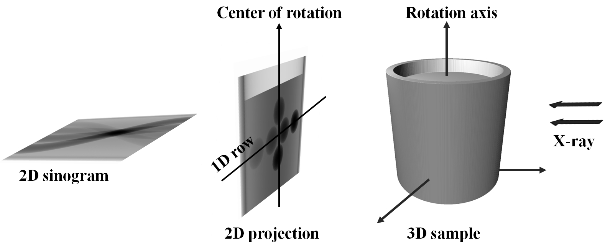
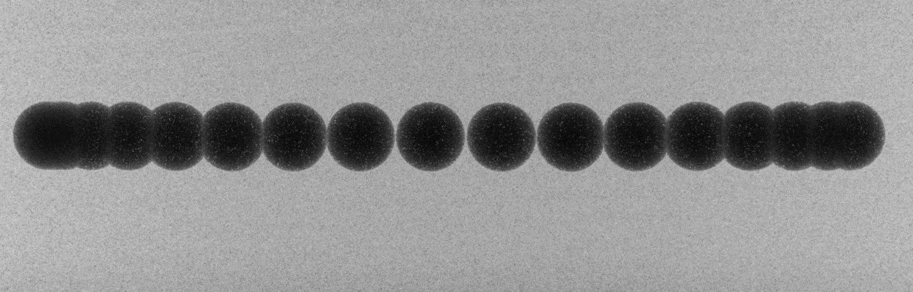
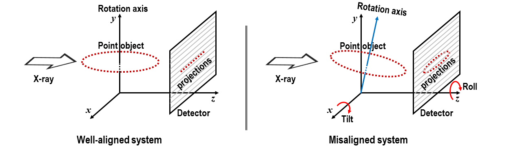

Alignment for a parallel-beam tomography system
===============================================

Due to the parallelism of the penetrating X-rays, 2D projections can be divided into independent 1D projection rows.
Collecting 1D projections at a specific row angularly forms a sinogram, which is used to reconstruct a 2D slice of
an object (:numref:`fig_1_6_1`). To ensure the independence of 1D projections at each row, it is crucial to maintain
the rotation axis parallel to the imaging plane and perpendicular to each image row. This requirement is known as
tomography alignment. In a synchrotron-based tomography system, the high configurability in using different optics
magnifications and/or sample-detector distances often causes the rotation axis being misaligned with the imaging plane.
As the result, alignment adjustments are necessary for different tomography setups.

    Schematic of parallel-beam X-ray tomography.

The misalignment of a tomography system is identified by measuring the tilt and roll angle of the rotation axis
relative to the imaging plane. This is achieved by scanning a point-like object, such as a sphere offset from the
rotation axis, through a full rotation and tracking the trajectory of its center of mass, as illustrated in :numref:`fig_1_6_2`.
A similar approach can be employed using a needle by tracking the top of it through a full rotation.

    Overlay of projections of a sphere during a circular scan.

In a well-aligned system, the range of y-coordinates of points remains below 1 pixel, as depicted in :numref:`fig_1_6_3`.
If the system is misaligned, the y-coordinates of points will appear as an ellipse; where the roll angle corresponds to
the angle of the major axis, and the tilt is related to the ratio between the minor and major axes of the ellipse.

    Demonstration of a well-aligned tomography system and a misaligned one

This section demonstrates how to use methods available in Algotom to calculate the tilt and roll angle of the rotation
axis from projections of a sphere scanned over the range of [0, 360] degrees.

-   Load the raw data and the corresponding flat-field images:

    .. code-block:: python

        import numpy as np
        import scipy.ndimage as ndi
        import matplotlib.pyplot as plt
        import algotom.io.loadersaver as losa
        import algotom.util.calibration as calib

        proj_path = "/tomo/data/scan_00001/"
        flat_path = "/tomo/data/scan_00002/"

        # If inputs are tif files
        proj_files = losa.find_file(proj_path + "/*.tif*")
        flat_files = losa.find_file(flat_path + "/*.tif*")
        proj_data = np.asarray([losa.load_image(file) for file in proj_files])
        flat = np.mean(np.asarray([losa.load_image(file) for file in flat_files]),
                       axis=0)

        # # If inputs are hdf files
        # hdf_key = "entry/data/data"  # Change to the correct key.
        # proj_data = losa.load_hdf(proj_path, hdf_key)
        # (depth, height, width) = proj_data.shape
        # flat = np.mean(np.asarray(losa.load_hdf(flat_path, hdf_key)), axis=0)
        flat[flat == 0.0] = np.mean(flat)

        have_flat = True
        fit_ellipse = True  # Use an ellipse-fit method

        crop_left = 10
        crop_right = 10
        crop_top = 800
        crop_bottom = 800
        ratio = 1.0  # To adjust the threshold for binarization if need to
        figsize = (15, 7)

        (depth, height, width) = proj_data.shape
        left = crop_left
        right = width - crop_right
        top = crop_top
        bottom = height - crop_bottom
        width_cr = right - left
        height_cr = bottom - top

-   For each projection, multiple preprocessing steps are applied to segment the sphere and determine its center of mass.
    These steps include flat-field correction, background removal, binarization, and the removal of non-spherical objects,
    as follows:

    .. figure:: section1_6/figs/fig_1_6_4.jpg
        :name: fig_1_6_4
        :figwidth: 70 %
        :align: center
        :figclass: align-center

        Projection of the sphere

    .. figure:: section1_6/figs/fig_1_6_5.jpg
        :name: fig_1_6_5
        :figwidth: 70 %
        :align: center
        :figclass: align-center

        Binarized image

    .. figure:: section1_6/figs/fig_1_6_6.jpg
        :name: fig_1_6_6
        :figwidth: 70 %
        :align: center
        :figclass: align-center

        Segmented sphere

    .. code-block:: python

        x_centers = []
        y_centers = []
        img_list = []
        print("\n=============================================")
        print("Extract the sphere and get its center-of-mass\n")

        for i, img in enumerate(proj_data):
            # Crop image and perform flat-field correction
            if have_flat:
                mat = img[top: bottom, left:right] / flat[top: bottom, left:right]
            else:
                mat = img[top: bottom, left:right]
            # Denoise
            mat = ndi.gaussian_filter(mat, 2)
            # Normalize the background.
            # Optional, should be used if there's no flat-field.
            mat = calib.normalize_background_based_fft(mat, 5)
            threshold = calib.calculate_threshold(mat, bgr='bright')
            # Binarize the image
            mat_bin0 = calib.binarize_image(mat, threshold=ratio * threshold, bgr='bright')
            sphere_size = calib.get_dot_size(mat_bin0, size_opt="max")
            # Keep the sphere only
            mat_bin = calib.select_dot_based_size(mat_bin0, sphere_size)
            nmean = np.sum(mat_bin)
            if nmean == 0.0:
                print(
                    "\n**************************************************************************")
                print(
                    "Adjust threshold or crop the FOV to remove objects larger than the sphere!")
                print("Current threshold used: {}".format(threshold))
                print(
                    "**************************************************************************")
                plt.figure(figsize=figsize)
                plt.imshow(mat_bin0, cmap="gray")
                plt.show()
                raise ValueError("No binary object selected!")
            (y_cen, x_cen) = ndi.center_of_mass(mat_bin)
            x_centers.append(x_cen)
            y_centers.append(height_cr - y_cen)
            img_list.append(mat)
            print("  ---> Done image: {}".format(i))
        x = np.float32(x_centers)
        y = np.float32(y_centers)
        img_list = np.asarray(img_list)
        img_overlay = np.min(img_list, axis=0)

-   The coordinates of the center of mass of the sphere are used to calculate the till and roll either
    using an ellipse-fit method or a linear-fit method.

    .. code-block:: python

        # ==============================================================================

        # Calculate the tilt and roll using an ellipse-fit or a linear-fit method

        if fit_ellipse is True:
            (a, b) = np.polyfit(x, y, 1)[:2]
            dist_list = np.abs(a * x - y + b) / np.sqrt(a ** 2 + 1)
            dist_list = ndi.gaussian_filter1d(dist_list, 2)
            if np.max(dist_list) < 1.0:
                fit_ellipse = False
                print("\nDistances of points to a fitted line is small, "
                      "Use a linear-fit method instead!\n")

        if fit_ellipse is True:
            try:
                result = fit_points_to_ellipse(x, y)
                roll_angle, major_axis, minor_axis, xc, yc = result
                tilt_angle = np.rad2deg(np.arctan2(minor_axis, major_axis))
            except ValueError:
                # If can't fit to an ellipse, using a linear-fit method instead
                fit_ellipse = False
                print(
                    "\nCan't fit points to an ellipse, using a linear-fit method instead!\n")

        if fit_ellipse is False:
            (a, b) = np.polyfit(x, y, 1)[:2]
            dist_list = np.abs(a * x - y + b) / np.sqrt(a ** 2 + 1)
            appr_major = np.max(np.asarray([np.sqrt((x[i] - x[j]) ** 2 +
                                                    (y[i] - y[j]) ** 2)
                                            for i in range(len(x))
                                            for j in range(i + 1, len(x))]))
            dist_list = ndi.gaussian_filter1d(dist_list, 2)
            appr_minor = 2.0 * np.max(dist_list)
            tilt_angle = np.rad2deg(np.arctan2(appr_minor, appr_major))
            roll_angle = np.rad2deg(np.arctan(a))

        print("=============================================")
        print("Roll angle: {} degree".format(roll_angle))
        print("Tilt angle: {} degree".format(tilt_angle))
        print("=============================================\n")

-   Show the results:

    .. code-block:: python

        plt.figure(1, figsize=figsize)
        plt.imshow(img_overlay, cmap="gray", extent=(0, width_cr, 0, height_cr))
        plt.figure(0, figsize=figsize)
        plt.plot(x, y, marker="o", color="blue")
        plt.title("Roll : {0:2.4f}; Tilt : {1:2.4f} (degree)".format(roll_angle, tilt_angle))
        if fit_ellipse is True:
            # Use parametric form for ploting the ellipse
            angle = np.radians(roll_angle)
            theta = np.linspace(0, 2 * np.pi, 100)
            x_fit = (xc + 0.5 * major_axis * np.cos(theta) * np.cos(angle)
                     - 0.5 * minor_axis * np.sin(theta) * np.sin(angle))
            y_fit = (yc + 0.5 * major_axis * np.cos(theta) * np.sin(angle)
                     + 0.5 * minor_axis * np.sin(theta) * np.cos(angle))
            plt.plot(x_fit, y_fit, color="red")
        else:
            plt.plot(x, a * x + b, color="red")
        plt.xlabel("x")
        plt.ylabel("y")
        plt.tight_layout()
        plt.show()

    .. figure:: section1_6/figs/fig_1_6_7.jpg
        :name: fig_1_6_7
        :figwidth: 100 %
        :align: center
        :figclass: align-center

        Overlay of projections of a sphere for checking.

    .. figure:: section1_6/figs/fig_1_6_8.jpg
        :name: fig_1_6_8
        :figwidth: 100 %
        :align: center
        :figclass: align-center

        Showing the result of finding the tilt and roll.

From the given results, we can adjust the rotation axis or the detector system accordingly. Note that the calculated
angles are based only on input images, so the sign of the angles does not reflect the true geometry of a
tomography system. Using information such as the direction of rotation when scanning spheres and/or camera orientation,
we can correctly identify the sign of these angles. After the adjustment, calculation results should be as follows:

    .. figure:: section1_6/figs/fig_1_6_9.jpg
        :name: fig_1_6_9
        :figwidth: 100 %
        :align: center
        :figclass: align-center

        Overlay of projections of a sphere after alignment.

    .. figure:: section1_6/figs/fig_1_6_10.jpg
        :name: fig_1_6_10
        :figwidth: 100 %
        :align: center
        :figclass: align-center

        Result of finding the tilt and roll after alignment.

The above routine performs very well in practice. However, if the projection images are of low quality due to blobs on
the scintillator or optics system, an additional cleaning step for image processing (using some functions in the
`scikit-image <https://scikit-image.org/docs/stable/api/skimage.morphology.html>`__ library) can be included as follows:

    .. code-block:: python

        from skimage import measure, segmentation

        def remove_non_round_objects(binary_image, ratio_threshold=0.9):
            """
            To clean binary image and remove non-round objects
            """
            binary_image = segmentation.clear_border(binary_image)
            binary_image = ndi.binary_fill_holes(binary_image)
            label_image = measure.label(binary_image)
            properties = measure.regionprops(label_image)
            mask = np.zeros_like(binary_image, dtype=bool)
            # Filter objects based on the axis ratio
            for prop in properties:
                if prop.major_axis_length > 0:
                    axis_ratio = prop.minor_axis_length / prop.major_axis_length
                    if axis_ratio > ratio_threshold:
                        mask[label_image == prop.label] = True
            # Apply mask to keep only round objects
            filtered_image = np.logical_and(binary_image, mask)
            return filtered_image

        # ...
        # Binarize the image
        mat_bin0 = calib.binarize_image(mat, threshold=ratio * threshold, bgr='bright')
        # Clean the image
        mat_bin0 = remove_non_round_objects(mat_bin0)
        sphere_size = calib.get_dot_size(mat_bin0, size_opt="max")
        # Keep the sphere only
        # ...
