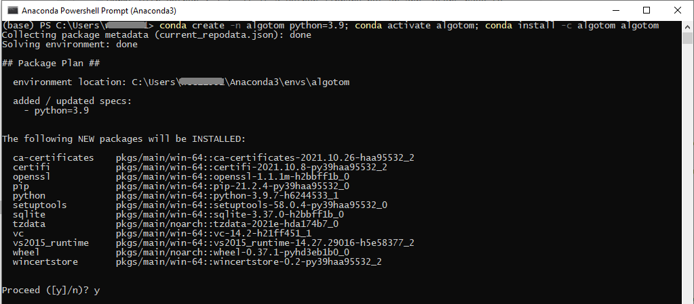
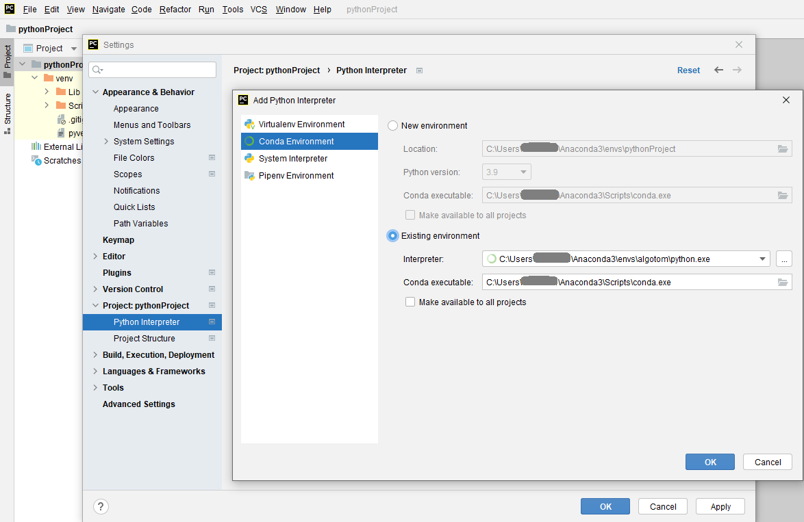

Installation
============

Algotom is installable across operating systems (Windows, Linux, Mac) and
works with Python >=3.7. It is a Python library not an app. Users have to
write Python codes to process their data. For beginners, a quick way to get started with Python
programming is to install `Anaconda <https://www.anaconda.com/products/individual>`__,
then follow instructions `here <https://docs.anaconda.com/anaconda/user-guide/getting-started/>`__.
There are many IDE software can be used to write and run Python codes e.g Spyder,
Pydev, `Pycharm (Community) <https://www.jetbrains.com/pycharm/download>`_, or Visual Studio Code. After installing these software, users
need to configure Python interpreter by pointing to the installed location of
Anaconda. Each software has instructions of how to do that. There is a list of standard
Python libraries shipped with `Anaconda <https://docs.anaconda.com/anaconda/packages/pkg-docs/>`__,
known as the *base* environment. To install a Python package out of the list, it's a good
practice that users should create a separate environment from the base. This `tutorial <https://www.freecodecamp.org/news/why-you-need-python-environments-and-how-to-manage-them-with-conda-85f155f4353c/>`_
gives an overview about Python environment. Instructions of how to create a new
environment and how to install new packages are `here <https://docs.conda.io/projects/conda/en/latest/user-guide/tasks/manage-environments.html>`__
and `here <https://docs.conda.io/projects/conda/en/latest/user-guide/tasks/manage-pkgs.html>`__.
The following image shows the screenshot of how to use Anaconda Powershell Prompt to create
a new environment and install Algotom.

Note that the IDE software needs to be reconfigured to point to the new environment
as shown below.

If users don't want to install Anaconda which is quite heavy due to the base
environment shipped with it, `Miniconda <https://docs.conda.io/projects/conda/en/latest/user-guide/install/download.html>`__
is enough to customize Python environment.

From source
-----------

Clone `Algotom <https://github.com/algotom/algotom>`__ from Github repository::

    git clone https://github.com/algotom/algotom.git algotom

Download and install `Miniconda  <https://docs.conda.io/en/latest/miniconda.html>`__ software, then:

Open Linux terminal or Miniconda/Anaconda Powershell prompt and run the following commands::

    conda create -n algotom python>=3.7
    conda activate algotom
    cd algotom
    python setup.py install

Using conda
-----------

Install Miniconda as instructed above, then:

Open Linux terminal or Miniconda/Anaconda Powershell prompt and run the following commands:

If install to an existing environment::

    conda install -c algotom algotom

If install to a new environment::

    conda create -n algotom python>=3.7
    conda activate algotom
    conda install -c algotom algotom

Algotom is also installable using the conda-forge channel::

	conda install -c conda-forge algotom

Using pip
---------

Install Miniconda as instructed above, then

Open Linux terminal or Miniconda/Anaconda Powershell prompt and run the following commands:

If install to an existing environment::

    pip install algotom

If install to a new environment::

    conda create -n algotom python>=3.7
    conda activate algotom
    pip install algotom

Notes
-----

To use GPU-enabled functions, users have to make sure that their computers have
a NVIDIA GPU and must install `CUDA Toolkit <https://developer.nvidia.com/cuda-toolkit-archive>`__.
Installing the latest version of CUDA Toolkit (or Python) is not recommended
as scientific software often takes time to update.

To compromise between ease-of-installation and performance, GPU-enabled reconstruction
functions in Algotom use `Numba <https://numba.readthedocs.io/en/stable/cuda/index.html>`__.
Users can use other reconstruction methods; which are optimized for speed such as
the gridding reconstruction method in `Tomopy <https://tomopy.readthedocs.io/en/latest/api/tomopy.recon.algorithm.html>`__
or GPU-enabled methods in `Astra Toolbox <https://www.astra-toolbox.com/docs/algs/index.html>`__;
using Algotom's wrappers. Making sure that Tomopy and Astra Toolbox are installed before use.
Referring to the websites of these packages to know how to install or acknowledge
if you use them.
