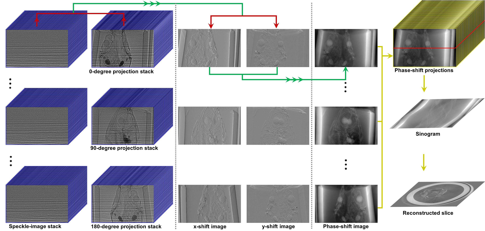

Implementations of X-ray speckle-based phase-contrast tomography
================================================================

From version 1.1, methods for speckle-based phase contrast imaging have been implemented into
Algotom. This is the result of the collaboration between the author, Nghia Vo, and his
collaborators: Hongchang Wang, Marie-Christine Zdora, Lingfei Hu, and Tunhe Zhou; who are
experienced with developing and using speckle-based imaging methods. This technical note
is to summarize the work done (for more detail, see :cite:`Vo:2022`).

Introduction
------------

When a sample interacts with a coherent X-ray beam, it will cause reduction in the intensity
and change in the direction of the beam. The latter effect comes from the phase shift of the
X-ray wave. Using the first effect to image samples in tomography, known as X-ray absorption-contrast
tomography, is a widely used technique. However, using the second effect for imaging samples
is much more challenging in practice. The resulting images, i.e. phase-shift images,
can be used for tomography to visualize internal features of samples having small differences in
densities at high contrast quality. This is the advantage of the technique, known as X-ray
phase-contrast tomography (X-PCT), over conventional X-ray tomography.

To retrieve a phase-shift image, there are two basic approaches: measuring change in the
direction of a beam then performing surface reconstruction; or matching a wave-propagation model
to measured intensities. `Speckle-based techniques <https://doi.org/10.1038/nphys837>`__ use the
first approach. They are very simple to use in terms of set-up, data acquisition, and data processing.
The idea of the techniques is to measure the shift of each speckle-image pixel, caused by a sample,
by comparing the images with and without the sample. Because the speckle-pattern size is larger
than the pixel-size of a detector, to resolve the shift for each pixel we use a stack of speckle-images
scanned at different positions, with and without sample, and analyze the images using a small window
around each pixel.

Data acquisition
----------------

For producing a random speckle-pattern, a diffuser made of a sandpaper can be used. The purpose of
a diffuser is to provide a reference-image used to detect local displacements caused by a sample.
It is crucial to get a high-contrast reference-image with the average feature size of a few pixels, e.g. 5-9 pixels.
A reference-image with the visibility, calculated as the ratio between the standard deviation value and
the mean value of pixel intensities, above 10% is good enough for use. For high-energy X-ray sources,
users can stack sandpapers together or using a box of material powder to improve the contrast of a
speckle-image. Other practical considerations for setting up an experiment are as follows:

    .. image:: section5_1/figs/img_5_1_1.png
        :name: img_5_1_1
        :width: 100 %
        :align: center

-   The diffuser can be positioned before or after a sample depending on experiment conditions. For example,
    in a parallel-beam system with a highly spatial-coherent source the diffuser can be placed closer to
    the source than the sample to make use of the edge-enhancement effect which helps to improve
    the contrast of the speckle-image.

-   The sample-detector distance should be chosen as a compromise between increasing the displacement
    effect and reducing the edge-enhancement effect caused by highly spatial-coherent sources.

-   There are different ways of shifting a diffuser and acquiring a tomogram at each position. However, using
    a spiral path has been proven to be practical and efficient :cite:`Zdora:2017`.
    The distance between two speckle positions should be larger than the analysis window, e.g. 5-11 pixels,
    to ensure that each speckle-pattern in the analysis window is completely different. This improves the
    robustness of methods measuring pixel shifts. Using this acquisition scheme, 20 positions of a diffuser
    is enough to retrieve a high-quality phase-shift image. However, for tomography systems with fluctuating
    sources, higher number of positions, e.g. 30-50, is needed.

-   Due to mechanical error, moving a sample in and out of the field-of-view repeatedly for each diffuser
    position can cause small shifts between the same projections of different tomograms. This problem has
    a significant impact to the quality of processed data and is difficult to correct. To avoid it, the best
    scanning approach is to scan all positions of a diffuser first, then collect tomograms of a sample at each
    diffuser position. This approach may result in small displacements between the same speckle positions due
    to mechanical error. However, it is correctable by image alignment using a small area of empty space within
    the sample image.

Data processing
---------------

Finding pixel shifts
++++++++++++++++++++

The core idea of the technique is to find the shift of each pixel of a speckle-image caused by a sample.
This is done by: selecting a small window (5-11 pixels) around each pixel of the sample-stack image; sliding
this window around a slightly larger window (margin ~10 pixels) taken from the reference-stack image and
calculating the cost function :cite:`Zdora:2017` or the correlation coefficient :cite:`Berujon:2016` between
two windows at each position. The resulting correlation-coefficient/cost-function map is used to locate the
maximum/minimum point where sub-pixel accuracy can be achieved by using a differential approach or a polynomial
fitting approach. The shift of a pixel is the distance from the maximum/minimum point to the center of the map.
The procedure of finding the shift of each pixel is depicted in :numref:`fig_5_1_1`.

Performing 2D searching for every pixel of a 2k×2k image is computationally very expensive which is why
using multicore-CPU and GPU for computing is crucially needed. An approximate approach to reduce the
computational cost is to perform 1D search :cite:`Wang:2021` using middle slices in vertical and horizontal
direction of image stacks, to find shifts in x and y-direction separately.

   Demonstration of how to find the shift of each speckle-pixel.

Surface reconstruction
++++++++++++++++++++++

The result of the previous step is separated into an x-shift image and a y-shift image, i.e. gradient images.
A phase-shift image is then retrieved by applying a method of surface reconstruction, or normal integration
(:numref:`fig_5_1_2`). There are many available options for implementing this step. However, Fourier-transform-based
methods :cite:`Frankot:1988, Simchony:1990` are preferred over least-squares methods due to their low computational
cost which is critical for tomography. The disadvantage of these Fourier methods is that the DC-component (average value of an image)
is undefined resulting in the fluctuations in background between phase-retrieved images. This effect, however,
can be corrected (:numref:`fig_5_1_3`) by using the double-wedge filter as described in :cite:`Vo:21`

   Phase-shift image (c) is retrieved by normal integration using two gradient
   images: (a) x-direction; (b) y-direction.

.. figure:: section5_1/figs/fig_5_1_3.jpg
   :name: fig_5_1_3
   :figwidth: 65 %
   :align: center
   :figclass: align-center

   (a) Fluctuation of grayscale values in a sinogram caused by the FT-based surface-reconstruction
   method. (b) Corrected image after using the double-wedge filter.

Extracting transmission and dark-field signals
++++++++++++++++++++++++++++++++++++++++++++++

Another interesting capability of the speckle-based technique is that transmission image
(absorption-contrast image) and dark-field image (small-angle scattering signal, not to be confused
with dark-noise of a camera) can be extracted from data together with the phase-shift image (:numref:`fig_5_1_4`).
There are `several ways <https://doi.org/10.3390/jimaging4050060>`__ to determine dark-signal image for correlation-based methods.
For the cost-based approach :cite:`Zdora:2017`, dark-signal image is easily to be obtained as a part of the model
equation.

.. figure:: section5_1/figs/fig_5_1_4.jpg
   :name: fig_5_1_4
   :figwidth: 95 %
   :align: center
   :figclass: align-center

   All imaging signal retrieved by the speckle-based technique can be used for tomography. (a) Phase-shift image.
   (b) Transmission image. (c) Dark-field image.

Tomographic reconstruction
++++++++++++++++++++++++++

Above processing steps are repeated for every projection then the results are used for tomographic
reconstruction as shown in :numref:`fig_5_1_5`

   Demonstration of the speckle-based phase-contrast tomography

Implementation
--------------

Design principles
+++++++++++++++++

Practical design-principles have been followed in the implementation:

-   To ensure that the software can work across platforms and is easy-to-install; dependencies are minimized,
    and only well-maintained Python libraries are used.
-   For high performance computing, making use of GPU, ease of understanding and use; Numba library is used instead
    of Cupy or PyCuda.
-   Methods are broken down into building blocks to be able to run on either small or large memory RAM/GPU.
    More importantly, this design allows users to customize methods or build data processing pipeline.

Top layer methods, API reference, for the software are as follows:

-	Reading images from multiple datasets, in tif or hdf format, and stacking them.
-	Finding local shifts between two images or two stacks of images.
-	Performing surface reconstruction from gradient images.
-	Retrieving phase-shift image given two stacks of images.
-	Extracting transmission image and dark-field image.
-	Aligning two images or two stacks of images.

Building blocks
+++++++++++++++

A dedicated module in Algotom, named `correlation <https://github.com/algotom/algotom/blob/master/algotom/util/correlation.py>`__,
is a collection of methods as the building blocks for the top layer methods described in the previous section.

The first block is a method to generate correlation-coefficient map between two 2D/3D images (:numref:`fig_5_1_1`).
This is the core method to find the shift between images. It works by sliding the second image over the reference
image and calculating the correlation coefficient at each position. There are many formulas to calculate this
coefficient. Here, we use `Pearson’s coefficient <https://en.wikipedia.org/wiki/Pearson_correlation_coefficient>`__
as it has been proven to be one of the most reliable metrics. The method includes low-level implementations for
specific cases: 2D or 3D input, using CPU or GPU.

The second block is a method to locate the maximum/minimum point of a correlation-coefficient/cost-function map
with sub-pixel accuracy where there are two approaches selected: either a differential approach :cite:`Fisher:2007`
or a polynomial fitting approach :cite:`Bing:2006`. At low-level are implementations to handle different cases: 1D
or 2D input, using the differential method or fitting method.

The above blocks are for finding the shift of each pixel using a small window around it. This operation is
applied to ~ 2k × 2k pixel. In practice, input data for retrieving a phase-shift image is two stacks of images;
each stack is around 20 images (20 speckle-positions); each image has a size of 2k × 2k. Total shape of the input
is 2 × 20 × 2k × 2k with the size of ~300MB (16-bit image). As can be seen, many strategies can be used to
parallelize workload. Here we find that processing data using chunk-by-chunk of image-rows in one go and
calculating the shifts row-by-row in parallel is the most efficient way in term of memory management, performance,
and code readability.

As mentioned above, the next building block is a method for finding the shift of each pixel in a chunk of
image-rows in parallel. The method includes low-level implementations for different cases: 1D or 2D search, 2D or
3D input, CPU or GPU computing. For GPU, to reduce the overhead of transferring data and compiling functions,
the first two blocks are implemented at GPU-kernel level.

The top building block is a method for `processing full-size images <https://algotom.readthedocs.io/en/latest/toc/api/algotom.prep.phase.html#algotom.prep.phase.retrieve_phase_based_speckle_tracking>`__.
It includes many options for processing at the lower-level blocks. The chunk-size option enables the method to run on
either small memory or large memory of RAM or GPU. Other top-layer methods listed in the previous section are
straightforward to implement either directly or by making use of the methods in the *correlation* module.

   Building blocks of the *correlation* module.

Demonstration
-------------

.. figure:: section5_1/figs/fig_5_1_7.jpg
   :name: fig_5_1_7
   :figwidth: 95 %
   :align: center
   :figclass: align-center

   Speckle-based tomographic experiment at beamline I12.

Data collected at `beamline I12 <https://www.diamond.ac.uk/Instruments/Imaging-and-Microscopy/I12/Techniques-at-I12.html>`__
at Diamond Light Source are used for demonstration. Details of how data were acquired are as follows:

-   A box of fine sand was used as a speckle generator and can achieve a visibility of 13% at 53keV X-rays with the
    detector-sample distance of 2.2m. A detector with the pixel size of 7.9 µm was used. Image-size is 2560 and 2160
    in height and width. The speckle-size is around 8 pixels. The intensity of the beam profile is very stable which
    is an important advantage of beamline I12. The sample is a `picrite basaltic rock <https://doi.org/10.1016/j.epsl.2018.04.025>`__
    from Iceland.

-	20 speckle positions following `a spiral path <https://algotom.readthedocs.io/en/latest/toc/api/algotom.util.utility.html#algotom.util.utility.generate_spiral_positions>`__
    with the step of 30 times of the pixel size were used for scanning.

-   Speckle images without the sample were acquired at all positions first. Then for each speckle position a
    tomographic scan of the sample, 1801 projections, was acquired. This strategy ensures that projections at
    the same angle are not shifted between speckle positions. Due to mechanical error, the diffuser positions
    were not the same between the first scan (without the sample) and the second scan (with the sample).
    This problem can be solved by `image alignment <https://algotom.readthedocs.io/en/latest/toc/api/algotom.prep.phase.html#algotom.prep.phase.find_shift_between_image_stacks>`__
    using free-space areas in each image (:numref:`fig_5_1_8`).

.. figure:: section5_1/figs/fig_5_1_8.jpg
   :name: fig_5_1_8
   :figwidth: 65 %
   :align: center
   :figclass: align-center

   Demonstration of the impact of image alignment. (a) Small area of an image which is the result of dividing
   between speckle-image with sample and without sample. (b) Same as (a) but after image alignment.

The following presents how the data were processed:

-   Reference-images for each position are loaded, averaged, normalized (flat-field corrected), `aligned <https://algotom.readthedocs.io/en/latest/toc/api/algotom.prep.phase.html#algotom.prep.phase.align_image_stacks>`__,
    and stacked.

-   For each angle of tomographic datasets, projections at different speckle-positions are loaded, normalized, and stacked.

-   Phase-shift image is retrieved from two previous image-stacks (:numref:`fig_5_1_9`) using a single function.
    Full options for choosing back-end methods, surface reconstruction methods, and searching parameters are at
    the `API reference page <https://algotom.readthedocs.io/en/latest/toc/api/algotom.prep.phase.html#algotom.prep.phase.retrieve_phase_based_speckle_tracking>`__.

   Speckle-image stack (a). Sample-image stack (b). Phase-shift image (c) retrieved from (a) and (b).

Algotom implements three approaches: the correlation-based method using 1D :cite:`Wang:2021` and 2D :cite:`Berujon:2016` search,
and the cost-based approach :cite:`Zdora:2017`, known as the UMPA (Unified Modulated Pattern Analysis) method.
A summary of computing time for retrieving a single phase-shift image using different options is shown
in :numref:`fig_5_1_10` where the window size is 7 and the margin is 10. As can be seen, there is a huge
speed-up of computing time if using GPU.

   Comparison of computing time using different approaches.

For tomographic reconstruction, phase retrieval is applied to all projections then the sinograms are generated
for reconstructing slice-by-slice. This step can be manually parallelized for multiple-CPUs or multiple-GPUs to
reduce computing time. In practice, users may want to tweak parameters and check the results before running full
reconstruction. This can be done by performing phase retrieval on a small area of projection-images.

:numref:`fig_5_1_11` shows reconstructed images in horizontal and vertical direction from the three approaches
where ring artifact removal methods :cite:`Vo:2018, Munch:2009` and the FBP reconstruction method were used. There
are several interesting findings from the results. Firstly, the 1D-search method gives less-sharp images than
other methods but with better contrast and clearer features. There is not much different between the 2D-search
method and the UMPA method out of the low-pass component. However, the main advantage of the UMPA approach over
the others is that three modes of image can be retrieved at the same time as shown in :numref:`fig_5_1_12`.
This figure is also a showcase for the speckle-based tomography technique where phase-shift images give
better contrast than transmission-signal images (red arrows). The technique reveals interesting features
of the sample which are mineral olivine. Because the olivine is a crystal it can enhance dark signal as
shown in :numref:`fig_5_1_12` (c,f). Making use of dark-signal images to gain deeper understanding of materials
is a very promising application of the technique.

   Horizontal slice and vertical slice of reconstructed volumes from the 3 approaches: the 1D-search method (a,d);
   the 2D-search method (b,e); and UMPA (c,f).

   Horizontal slice and vertical slice of reconstructed volumes from 3 imaging modes: phase-shift image (a,d);
   transmission image (b,e); and dark-signal image (c,f).

Python codes used to process data for this report are at `here <https://github.com/algotom/algotom/tree/master/examples/speckle_based_tomography/i12_data>`__.
Detailed references can be found in :cite:`Vo:2022`.