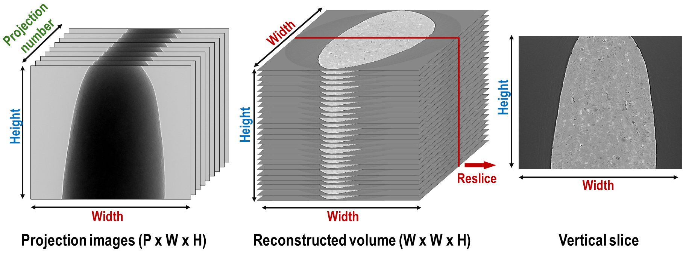
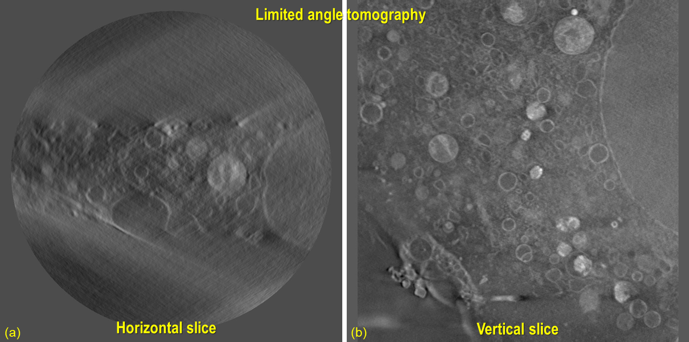
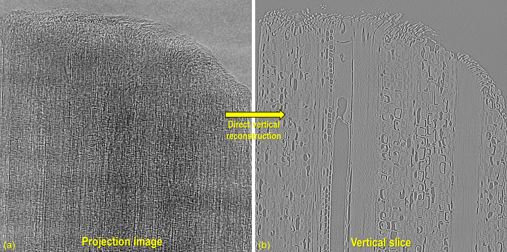
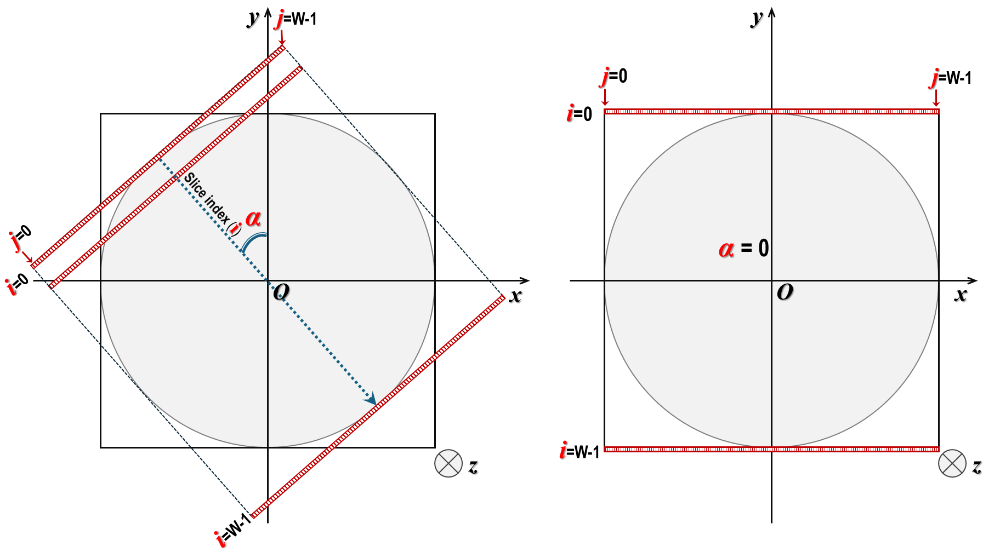
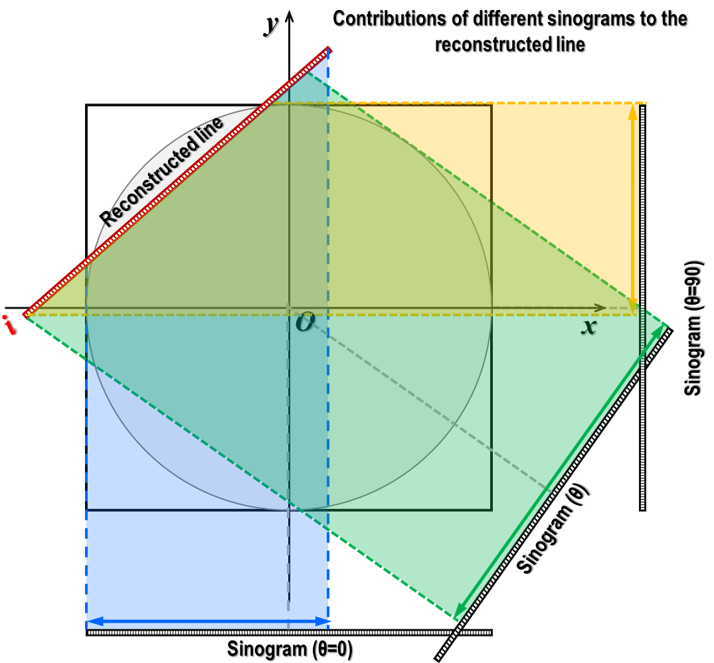
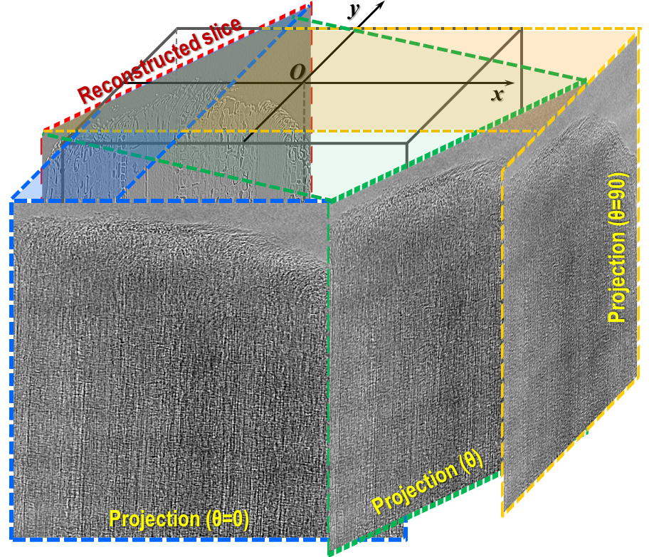
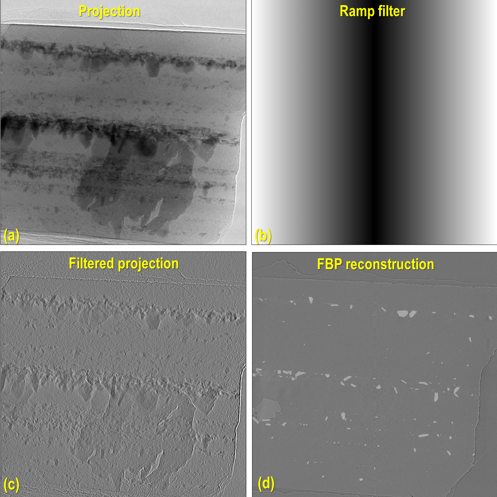
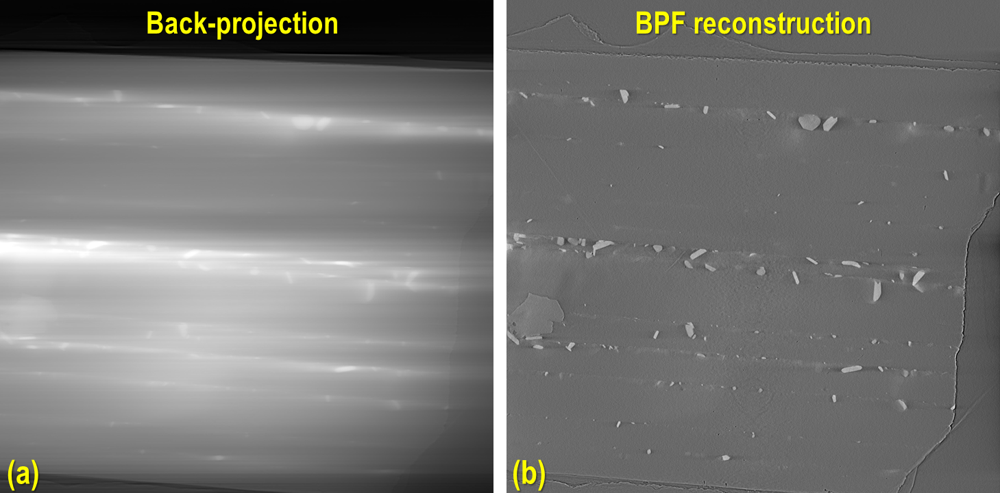
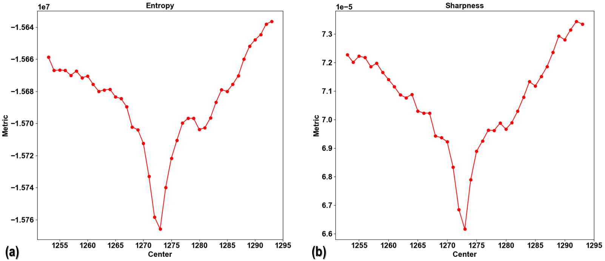
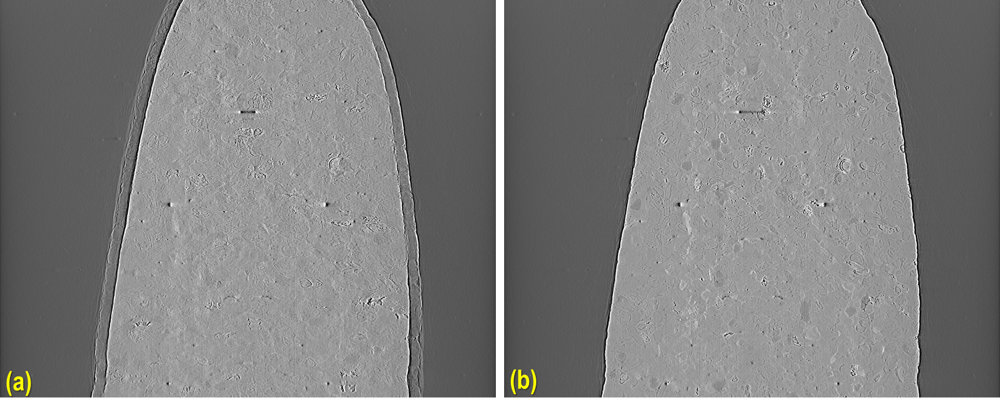

.. _section5_2:

Implementations of direct vertical-slice reconstruction for tomography
======================================================================

Introduction
------------

Traditionally, to obtain a vertical slice, we must reconstruct slice-by-slice to a full volume, then perform slicing
across the height of the reconstructed volume. However, this approach is inefficient for thin or elongated samples.
There are unused data volumes where no sample is present but are still retained on disk. It would be more effective to
directly reconstruct vertical slices only around the volume containing the sample.

    Demonstration of how to extract a vertical slice from a tomography dataset. Assume a tomography dataset consists
    of 1800 projections, each sized 2560 (W) x 2160 (H) in 16-bit format, totaling approximately 20 GB. The size of
    a full reconstruction in 32-bit format is about 52 GB. This volume needs to be stored temporarily before
    extracting a vertical slice.

Another important application of vertical slice reconstruction is for limited angle tomography, which is often the case
for tilt-series electron tomography or cryo-soft X-ray tomography. For reconstructed data from this acquisition,
artifacts make it difficult to identify the center of rotation or segment the image. However, if the volume is resliced
vertically, the sample features are complete, which simplifies segmentation or determining the center of rotation.

    Vertical slicing is crucial for analyzing data acquired by limited-angle tomography. (a) Conventionally
    reconstructed slice, showing artifacts caused by missing angles. (b) Same data, represented with a vertical slice.
    Raw data provided by Matthew Spink, Diamond Light Source.

Last but not least, for certain types of samples and their features, e.g., multilayer structures parallel to the beam,
it is challenging to find the center of rotation or preliminarily evaluate image quality using conventional reconstructed
slices. However, things are much easier when a vertical slice is used.

Given these reasons, it's important to implement this method and make it available to the community. Similar works have
been done elsewhere but have either been discontinued, are not implemented in pure Python, or lack practical features.
This section presents work done to enable vertical slice reconstruction. Methods can run on multi-core CPUs and GPUs
using Numba. Two reconstruction methods have been implemented: FBP (Filtered back-projection) and BPF (Back-projection filtering).
Data is processed chunk-by-chunk to fit available RAM or GPU memory. The methods allow the reconstruction of a single
vertical slice, a chunk of vertical slices with selectable gaps between slices, or multiple vertical slices at different
angles. Utilities for determining the center of rotation automatically and manually are provided.

    Demonstration of direct vertical reconstruction.

Implementation
--------------

Requirements
++++++++++++

-   Slice location and its angle (around the z-axis) can be chosen arbitrarily.
-   Users can choose to reconstruct a single slice or multiple slices.
-   Users don't need a high-specs computer to process data.
-   Methods can run on either multicore CPUs or a single GPU, depending on GPU availability..
-   Data can be read and processed chunk-by-chunk to fit available RAM or GPU memory.
-   Input is an HDF-object, numpy array, or emulated HDF-object; for a normal computer, input must be an HDF
    file from which data can be loaded or an extracted subset into memory. For other formats, it can be converted to HDF
    or wrapped into an HDF-emulator to extract a subset of data.
-   FBP method and BPF method are implemented as they are feasible and practical.
-   Users need methods to manually and automatically determine the center of rotation (rotation axis).

Geometry definition
+++++++++++++++++++

Given a reconstruction space with the dimensions of *Width (W) x Width (W)*, users will input the slice index as an
integer in the range of [0;  *W-1*], along with angle *alpha*. Based on this information, the coordinates of
pixels belonging to a vertical slice can be calculated, as shown in :numref:`fig_5_2_4`. Note that in the vertical
slice plane, the xy coordinates remain the same across the z-slice.

    XY-coordinates of pixels in a vertical slice at different orientations.

Back projection, the ramp filter, and reconstruction
++++++++++++++++++++++++++++++++++++++++++++++++++++

From the coordinates of data points on the slice (in pixel units), we can determine the contributions from different
sinograms to this slice, known as back-projection i.e, sinograms are projected onto the reconstructed line as
demonstrated in  :numref:`fig_5_2_5`

    Contributions of different sinograms to the reconstructed line.

The above routine is applied across the height of projection images.

    Contributions of different projections to the reconstructed slice.

In direct tomographic reconstruction methods, the ramp filter is used to compensate for the non-uniform sampling
rate of tomographic data. The closer a part of the sample is to the rotation axis, the higher the sampling rate; i.e.,
its contribution to projection-images is greater. The ramp filter can be applied to projection images before the back-projection, as shown in
:numref:`fig_5_2_7`. This is the  well-known `Filtered Back-Projection (FBP) method <http://engineering.purdue.edu/~malcolm/pct/CTI_Ch03.pdf>`__.

    Projection image is filtered by the ramp filter before the back-projection.

A problem with this approach is that the ramp filter is applied to every projection image, which means the
computational cost is high. A more practical approach is to apply the ramp filter after the back-projection, known as
the Back-Projection Filtering (BPF) method. In this method, the ramp filter is used only once after the back-projection
of all projection images is complete.

    Demonstration of the Back-Projection Filtering method.

The advantage of BPF over FBP is that a reconstructed slice is less noisy because the summation of projections
in the back-projection process cancels out random noise. In contrast, FBP enhances random noise
(by the ramp filter) before back-projection, which makes the reconstructed slice noisier. The disadvantage of BPF is
that it is not a quantifiable method (i.e., the reconstructed values are not linearly related to the attenuation
coefficients of the sample). Moreover, there are shadow artifacts around strongly absorbing areas, as can be seen by
comparing :numref:`fig_5_2_8` (b) and :numref:`fig_5_2_7` (d).

Despite these disadvantages, BPF is practical due to its lower computational cost and less noisy results. It can be
used for automatically finding the center of rotation. Most importantly, in real applications, users are more interested
in segmenting different features of reconstructed slices rather than measuring attenuation coefficients. For these
reasons, BPF is still considered useful in practice.

Center of rotation determination
++++++++++++++++++++++++++++++++

For a standard tomographic dataset, the center of rotation can be found using a sinogram, 0-degree and 180-degree
projection images, or reconstructed slices, as presented :ref:`here <find_center>`. However, for samples much larger
than the field of view, data with low signal-to-noise ratios, or limited-angle tomography, these methods cannot be
used or do not perform well. In such cases, using metrics from vertical reconstructed slices at different estimated
centers to find the optimal center is handy. In Algotom (version>=1.6.0), three metrics are provided:
`'entropy' <https://doi.org/10.1364/JOSAA.23.001048>`__ , 'sharpness', and 'autocorrelation'.

    Finding the center of rotation using metrics of reconstructed slices: (a) Entropy; (b) Sharpness.

The last two metrics make use of the double-edge artifacts in reconstructed vertical slices caused by an incorrect center
to find the optimal value. The efficiency of each metric can depend on the sample. Finding a robust metric that works for
most cases is still a work in progress. For cases where the provided metrics may not perform well, users have the option
to provide a custom metric function. If none of the automated methods work, a manual method is provided by generating a
series of reconstructed slices at different centers and saving them to disk for visual inspection.

    Finding the center of rotation by visual inspection: (a) Incorrect center; (b) optimal center

Demonstrations
--------------

Practical insights
++++++++++++++++++

**Loading data in chunks**

In vertical slice reconstruction, the entire dataset must be read and processed. To manage this without requiring a
high-spec computer, data must be processed in chunks. When the input is in HDF format, this process is straightforward
because subsets of the HDF file can be accessed directly. For other formats such as TIFF, TXRM, XRM, etc., we need
wrappers to simulate the behavior of HDF files,  allowing subset data to be loaded using `NumPy indexing syntax <https://numpy.org/doc/stable/user/basics.indexing.html>`__,
or by simply converting these file formats to HDF. As the I/O overhead for this reconstruction method is high, the
overall performance depends on the performance of the storage system. A faster I/O system yields faster results.
There is a significant difference in performance between SSD, HDD, and network storage systems.

**Finding the center of rotation**

If the tomographic data is complete, i.e., acquired over the full range of [0-180] degrees, other faster methods can
be used to find the center of rotation. In limited-angle tomography, or where the aforementioned methods do not
perform well, we can measure metrics of vertical slices at different centers. To reduce computational costs, it is
sufficient to process only a small height of projection images.

**Reconstructing multiple slices**

As the time cost of data loading is the same for reconstructing a single slice or multiple slices, it's more
efficient to reconstruct multiple slices at once. This feature is provided in Algotom, which allows users to
reconstruct multiple parallel slices with a selectable step (in pixel units) between slices. Alternatively, users
can choose to reconstruct different slices at different orientations around the z-axis.

**Selecting slice orientation**

Vertical slice reconstruction is most efficient for limited-angle tomography. To minimize artifacts from missing angles,
the optimal orientation for reconstructed vertical slices is perpendicular to the midpoint of the missing angle range.
For thin or rectangular-shaped samples, the slice should be parallel to the longest edge. To automate the determination
of the angle, we can identify the row in a sinogram image giving the minimum intensity (absorption-contrast tomography).

Workflows
+++++++++

The methods described in this technical note are implemented in the module **vertrec.py** within Algotom package. Details
of the API are provided :ref:`here <vertrec_module>`.

The following workflow reconstructs a few vertical slices from raw data under these conditions: the input consists of
HDF files; the center of rotation is calculated using a sinogram-based method; the BPF reconstruction method is used;
and the output is saved as tiff images.

    .. code-block:: python

        import os
        import time
        import h5py
        import shutil
        import numpy as np
        import algotom.io.loadersaver as losa
        import algotom.prep.correction as corr
        import algotom.prep.removal as remo
        import algotom.prep.filtering as filt
        import algotom.prep.calculation as calc
        import algotom.rec.vertrec as vrec
        import algotom.util.utility as util

        output_base = "E:/vertical_slices/"

        proj_file = "E:/Tomo_data/projections.hdf"
        flat_file = "E:/Tomo_data/flats.hdf"
        dark_file = "E:/Tomo_data/darks.hdf"
        key_path = "entry/data/data"

        # Load projection data as a hdf object
        proj_obj = losa.load_hdf(proj_file, key_path)
        (depth, height, width) = proj_obj.shape
        # Load dark-field and flat-field images, average each result
        flat_field = np.mean(np.asarray(losa.load_hdf(flat_file, key_path)), axis=0)
        dark_field = np.mean(np.asarray(losa.load_hdf(dark_file, key_path)), axis=0)

        crop = (0, 0, 0, 0)  # (crop_top, crop_bottom, crop_left, crop_right)
        (depth, height0, width0) = proj_obj.shape
        top = crop[0]
        bot = height0 - crop[1]
        left = crop[2]
        right = width0 - crop[3]
        width = right - left
        height = bot - top

        t0 = time.time()
        # Find center of rotation using a sinogram-based method
        mid_slice = height // 2 + top
        sinogram = corr.flat_field_correction(proj_obj[:, mid_slice, left:right],
                                              flat_field[mid_slice, left:right],
                                              dark_field[mid_slice, left:right])
        sinogram = remo.remove_all_stripe(sinogram, 2.0, 51, 21)
        center = calc.find_center_vo(sinogram)
        print(f"Center-of-rotation is: {center}")

        start_index = width // 2 - 250
        stop_index = width // 2 + 250
        step_index = 20
        alpha = 0.0  # Orientation of the slices, in degree.

        # Note that raw data is flat-field corrected and cropped if these parameters
        # are provided. The center referred to cropped image.
        ver_slices = vrec.vertical_reconstruction_multiple(proj_obj, start_index, stop_index, center,
                                                           alpha=alpha, step_index=step_index,
                                                           flat_field=flat_field, dark_field=dark_field,
                                                           angles=None, crop=crop, proj_start=0,
                                                           proj_stop=-1, chunk_size=30,
                                                           ramp_filter="after", filter_name="hann",
                                                           apply_log=True, gpu=True, block=(16, 16),
                                                           ncore=None, prefer="threads",
                                                           show_progress=True, masking=False)
        print("Save output ...")
        for i, idx in enumerate(np.arange(start_index, stop_index + 1, step_index)):
            losa.save_image(output_base + f"/slice_{idx:05}.tif", ver_slices[i])
        t1 = time.time()
        print(f"All done in {t1 - t0}s!")

If the input consists of TIF files, Algotom (>=1.6.0) provides a method for emulating an HDF-object, which allows
to extract sub-data from TIF files in the same way as to an HDF file.

    .. code-block:: python

        # .......

        proj_path = "E:/Tomo_data/projections/"
        flat_path = "E:/Tomo_data/flats/"
        dark_path = "E:/Tomo_data/darks/"

        # Create hdf-emulator
        proj_obj = cvt.HdfEmulatorFromTif(proj_path)
        (depth, height, width) = proj_obj.shape
        # Load dark-field and flat-field images, average each result
        flat_field = np.mean(np.asarray(
            [losa.load_image(file) for file in losa.find_file(flat_path + "/*tif*")]), axis=0)
        dark_field = np.mean(np.asarray(
            [losa.load_image(file) for file in losa.find_file(dark_path + "/*tif*")]), axis=0)

        # ......

Users can reconstruct multiple slices at different orientations as follows

    .. code-block:: python

        # .......
        slice_indices = [width // 2, width // 3, width // 4, width // 2]
        alphas = [0.0, 30.0, 60.0, 90.0]  # Orientation of the slices, in degree.
        # Note that raw data is flat-field corrected and cropped if these parameters
        # are provided. The center referred to cropped image.
        ver_slices = vrec.vertical_reconstruction_different_angles(proj_obj, slice_indices, alphas,
                                                                   center, flat_field=flat_field,
                                                                   dark_field=dark_field, angles=None,
                                                                   crop=crop, proj_start=0, proj_stop=-1,
                                                                   chunk_size=30, ramp_filter='after',
                                                                   filter_name='hann', apply_log=True,
                                                                   gpu=True, block=(16, 16),
                                                                   ncore=None, prefer='threads',
                                                                   show_progress=True, masking=False)
        print("Save output ...")
        for i, idx in enumerate(slice_indices):
            losa.save_image(output_base + f"/slice_{idx:05}_angle_{alphas[i]:3.2f}.tif", ver_slices[i])
        t1 = time.time()
        print("All done !!!")

    .. figure:: section5_2/figs/fig_5_2_11.png
        :name: fig_5_2_11
        :figwidth: 100 %
        :align: center
        :figclass: align-center

        Reconstruction of multiple slices at different orientations at once.

Depending on samples and data, if other methods such as sinogram-based, projection-based, or horizontal-slice-based
approaches are not applicable, users can determine the center automatically or manually using vertical slices,
as demonstrated below.

    .. code-block:: python

        # Crop data to fit the memory and for fast calculation
        crop = (1000, 1000, 0, 0)  # (crop_top, crop_bottom, crop_left, crop_right)
        (depth, height0, width0) = proj_obj.shape
        top = crop[0]
        bot = height0 - crop[1]
        left = crop[2]
        right = width0 - crop[3]
        width = right - left
        height = bot - top

        t0 = time.time()
        flat = flat_field[top:bot, left:right]
        dark = dark_field[top:bot, left:right]
        flat_dark = flat - dark
        flat_dark[flat_dark == 0.0] = 1.0
        # Load data to memory and perform flat-field correction
        projs_corrected = (proj_obj[:, top:bot, left:right] - dark) / flat_dark

        auto_finding = False
        slice_use = width // 2 - 50  # Avoid the middle slice due to ring artifacts
        start_center = width // 2 - 20
        stop_center = width // 2 + 20
        step = 1.0

        if auto_finding:
            return_metric = True
            metric = "entropy"
            invert_metric = True  # Depending on samples, may need to invert the metrics.
            if return_metric:
                centers, metrics = vrec.find_center_vertical_slice(projs_corrected, slice_use,
                                                                   start_center, stop_center, step=step,
                                                                   metric=metric, alpha=0.0, angles=None,
                                                                   chunk_size=30, apply_log=True,
                                                                   gpu=True, block=(32, 32),
                                                                   ncore=None, prefer="threads",
                                                                   show_progress=True,
                                                                   invert_metric=invert_metric,
                                                                   return_metric=return_metric)
                plt.xlabel("Center")
                plt.ylabel("Metric")
                plt.plot(centers, metrics, "-o")
                center = centers[np.argmin(metrics)]
            else:
                center = vrec.find_center_vertical_slice(projs_corrected, slice_use, start_center,
                                                         stop_center, step=step, metric=metric,
                                                         alpha=0.0, angles=None, chunk_size=30,
                                                         apply_log=True, gpu=True, block=(32, 32),
                                                         ncore=None, prefer="threads",
                                                         show_progress=True,
                                                         invert_metric=invert_metric,
                                                         return_metric=return_metric)
            print(f"Center of rotation {center}")
            if return_metric:
                plt.show()
        else:
            vrec.find_center_visual_vertical_slices(projs_corrected, output_base, slice_use,
                                                    start_center, stop_center, step=step,
                                                    alpha=0.0, angles=None, chunk_size=30,
                                                    apply_log=True, gpu=True, block=(16, 16),
                                                    ncore=None, prefer="processes",
                                                    display=True, masking=True)
        t1 = time.time()
        print(f"All done in {t1 - t0}s!")

In X-ray tomography, pre-processing methods such as ring artifact removal and contrast enhancement are key to achieving
high-quality data, not just the reconstruction method. Below, we show how to include these methods into the workflow.

    .. code-block:: python

        # ...
        # Apply preprocessing methods along the sinogram direction and save intermediate
        # results to disk
        chunk_size = 30  # Number of sinograms to be processed at once
        file_tmp = output_base + "/tmp_/preprocessed.hdf"
        hdf_prep = losa.open_hdf_stream(file_tmp, (depth, height, width),
                                        data_type="float32", key_path=key_path)
        last_chunk = height - chunk_size * (height // chunk_size)
        flat = flat_field[top:bot, left:right]
        dark = dark_field[top:bot, left:right]
        flat_dark = flat - dark
        flat_dark[flat_dark == 0.0] = 1.0

        # ring_removal_method = remo.remove_all_stripe
        # ring_removal_paras = [2.5, 51, 21]
        ring_removal_method = remo.remove_stripe_based_normalization
        ring_removal_paras = [15, 1, False]

        for i in range(0, height - last_chunk, chunk_size):
            start = i + top
            stop = start + chunk_size
            # Flat-field correction
            proj_chunk = (proj_obj[:, start: stop, left:right] -
                          dark[i:i + chunk_size]) / flat_dark[i:i + chunk_size]
            # Apply ring artifact removal
            proj_chunk = util.parallel_process_slices(proj_chunk, ring_removal_method,
                                                      ring_removal_paras, axis=1,
                                                      ncore=None, prefer="threads")
            # Apply contrast enhancement
            proj_chunk = util.parallel_process_slices(proj_chunk, filt.fresnel_filter,
                                                      [300.0, 1], axis=1,
                                                      ncore=None, prefer="threads")
            hdf_prep[:, i: i + chunk_size, :] = proj_chunk
            t1 = time.time()
            print(f" Done sinograms {i}-{i + chunk_size}. Time elapsed: {t1 - t0}")
        if last_chunk != 0:
            start = height - last_chunk
            stop = height
            # Flat-field correction
            proj_chunk = (proj_obj[:, start: stop, left:right] -
                          dark[-last_chunk:]) / flat_dark[-last_chunk:]
            # Apply ring artifact removal
            proj_chunk = util.parallel_process_slices(proj_chunk, ring_removal_method,
                                                      ring_removal_paras, axis=1,
                                                      ncore=None, prefer="threads")
            # Apply contrast enhancement
            proj_chunk = util.parallel_process_slices(proj_chunk, filt.fresnel_filter,
                                                      [300.0, 1], axis=1,
                                                      ncore=None, prefer="threads")
            hdf_prep[:, -last_chunk:, :] = proj_chunk
            t1 = time.time()
            print(f" Done sinograms {start - top}-{stop - top}. Time elapsed: {t1 - t0}")
        t1 = time.time()
        print(f"\nDone preprocessing. Total time elapsed {t1 - t0}")

        start_index = width // 2 - 250
        stop_index = width // 2 + 250
        step_index = 20
        alpha = 0.0  # Orientation of the slices, in degree.
        #  Load preprocessed projections and reconstruct
        with h5py.File(file_tmp, 'r') as hdf_obj:
            preprocessed_projs = hdf_obj[key_path]
            ver_slices = vrec.vertical_reconstruction_multiple(preprocessed_projs, start_index,
                                                               stop_index, center, alpha=alpha,
                                                               step_index=step_index,
                                                               flat_field=None, dark_field=None,
                                                               angles=None, crop=(0, 0, 0, 0),
                                                               proj_start=0, proj_stop=-1,
                                                               chunk_size=30, ramp_filter="after",
                                                               filter_name="hann", apply_log=True,
                                                               gpu=True, block=(16, 16),
                                                               ncore=None, prefer="threads",
                                                               show_progress=True,
                                                               masking=False)
        # Save output
        print("Save output ...")
        for i, idx in enumerate(np.arange(start_index, stop_index + 1, step_index)):
            losa.save_image(output_base + f"/slice_{idx:05}.tif", ver_slices[i])
        t1 = time.time()
        print(f"All done in {t1 - t0}s!")

        # Delete the intermediate file
        folder_tmp = os.path.dirname(file_tmp)
        try:
            shutil.rmtree(folder_tmp)
        except PermissionError as e:
            print(f"Error deleting the file in folder: {e}. It may still be in use.")

After tweaking parameters for ring artifact removal, contrast enhancement, and choice of reconstruction methods, we can
proceed to the next step of performing a full reconstruction.

    .. code-block:: python

        # ....

        # Full reconstruction data has a size of (height, width, width)
        # We can select number of slices to be reconstructed
        slice_chunk = 30  # To select number of slices to be reconstructed at once.
        start_slice = 0
        stop_slice = width - 1
        total_slice = stop_slice - start_slice + 1
        last_chunk = total_slice - slice_chunk * (total_slice // slice_chunk)
        alpha = 0.0  # Orientation of the slices, in degree.
        #  Load preprocessed projections and reconstruct chunk-by-chunk
        print("========================================================")
        print("Perform full reconstruction\n")
        with h5py.File(file_tmp, 'r') as hdf_obj:
            preprocessed_projs = hdf_obj[key_path]
            for ii in range(0, total_slice - last_chunk, slice_chunk):
                start = ii + start_slice
                stop = start + slice_chunk - 1  # Reconstruction method counts the last index
                ver_slices = vrec.vertical_reconstruction_multiple(preprocessed_projs, start,
                                                                   stop, center, alpha=alpha,
                                                                   step_index=1, flat_field=None,
                                                                   dark_field=None, angles=None,
                                                                   crop=(0, 0, 0, 0), proj_start=0,
                                                                   proj_stop=-1, chunk_size=30,
                                                                   ramp_filter="after",
                                                                   filter_name="hann", apply_log=True,
                                                                   gpu=True, block=(16, 16), ncore=None,
                                                                   prefer="threads", show_progress=False,
                                                                   masking=False)
                # Save output
                for i, idx in enumerate(np.arange(start, stop + 1)):
                    losa.save_image(output_base + f"/slice_{idx:05}.tif", ver_slices[i])
                t1 = time.time()
                print(f" Reconstructed slices: {start}-{stop}. Time elapsed {t1 - t0}")
            if last_chunk != 0:
                start = total_slice - last_chunk + start_slice
                stop = start + last_chunk - 1  # Reconstruction method counts the last index
                ver_slices = vrec.vertical_reconstruction_multiple(preprocessed_projs, start,
                                                                   stop, center, alpha=alpha,
                                                                   step_index=1, flat_field=None,
                                                                   dark_field=None, angles=None,
                                                                   crop=(0, 0, 0, 0), proj_start=0,
                                                                   proj_stop=-1, chunk_size=30,
                                                                   ramp_filter="after",
                                                                   filter_name="hann", apply_log=True,
                                                                   gpu=True, block=(16, 16), ncore=None,
                                                                   prefer="threads", show_progress=False,
                                                                   masking=False)
                # Save output
                for i, idx in enumerate(np.arange(start, stop + 1)):
                    losa.save_image(output_base + f"/slice_{idx:05}.tif", ver_slices[i])
                t1 = time.time()
                print(f" Reconstructed slices: {start}-{stop}. Time elapsed {t1 - t0}")
        t1 = time.time()
        print(f"All done in {t1 - t0}s!")

Complete Python scripts for the each of above workflow are available `here <https://github.com/algotom/algotom/tree/master/examples/vertical_reconstruction>`__.

As the method processes data chunk-by-chunk and incurs significant I/O overhead, users can adjust the size of each chunk
to optimize computing time. For context, below is the elapsed time for reconstructing vertical slices of a
tomographic dataset with 1801 projections, where each image has a size of 2160 x 2560:

-   For reconstructing 100 slices (2160 x 2560) at once using a GPU (NVIDIA RTX A4500) and the BPF method: 464 seconds, averaging 4.6 seconds per slice.
-   Doing the same using a CPU (Intel Xeon 6230R, 26 cores): 1121 seconds, averaging 11.21 seconds per slice.

As can be seen, the performance of using a multicore CPU is not far behind that of the GPU. The reason is the overhead
of data transfer in GPU computing.

Last but not least, users should be aware that ring artifacts in vertical slices can resemble real features. As shown
in the figure below, these artifacts appear as voids inside rock samples. A simple way to detect them is to check for
mirror features across the middle line of the image.

    .. figure:: section5_2/figs/fig_5_2_12.png
        :name: fig_5_2_12
        :figwidth: 100 %
        :align: center
        :figclass: align-center

        Appearance of ring artifacts in a vertical slice.

