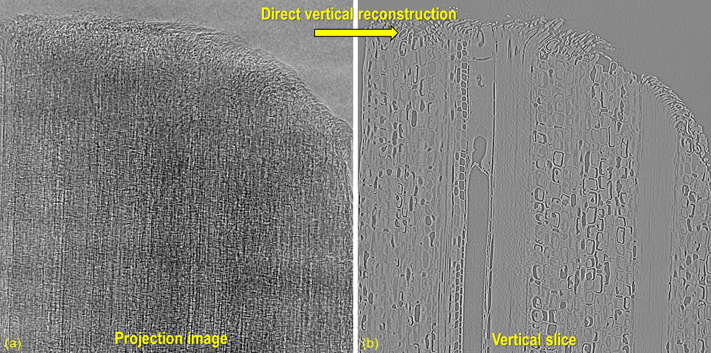

.. _section5_2:

Implementation of direct vertical-slice reconstruction for tomography
=====================================================================

Introduction
------------

Traditionally, to obtain a vertical slice, we must reconstruct slice-by-slice to a full volume, then perform slicing
across the height of the reconstructed volume. However, this approach is inefficient for thin or elongated samples.
There are unused data volumes where no sample is present but are still retained on disk. It would be more effective to
directly reconstruct vertical slices only around the volume containing the sample.

.. figure:: section5_2/figs/fig_5_2_1.png
    :name: fig_5_2_1
    :figwidth: 100 %
    :align: center
    :figclass: align-center

    Demonstration of how to extract a vertical slice from a tomography dataset. Assume a tomography dataset consists
    of 1800 projections, each sized 2560 (W) x 2160 (H) in 16-bit format, totaling approximately 20 GB. The size of
    a full reconstruction in 32-bit format is about 52 GB. This volume needs to be stored temporarily before
    extracting a vertical slice.

Another important application of vertical slice reconstruction is for limited angle tomography, which is often the case
for tilt-series electron tomography or cryo-soft X-ray tomography. For reconstructed data from this acquisition,
artifacts make it difficult to identify the center of rotation or segment the image. However, if the volume is resliced
vertically, the sample features are complete, which simplifies segmentation or determining the center of rotation.

.. figure:: section5_2/figs/fig_5_2_2.png
    :name: fig_5_2_2
    :figwidth: 100 %
    :align: center
    :figclass: align-center

    Vertical slicing is crucial for analyzing data acquired by limited-angle tomography. (a) Conventionally
    reconstructed slice, showing artifacts caused by missing angles. (b) Same data, represented with a vertical slice.

Last but not least, for certain types of samples and their features, e.g., multilayer structures parallel to the beam,
it is challenging to find the center of rotation or preliminarily evaluate image quality using conventional reconstructed
slices. However, things are much easier when a vertical slice is used.

Given these reasons, it's important to implement this method and make it available to the community. Similar works have
been done elsewhere but have either been discontinued, are not implemented in pure Python, or lack practical features.
This section presents work done to enable vertical slice reconstruction. Methods can run on multi-core CPUs and GPUs
using Numba. Two reconstruction methods have been implemented: FBP (Filtered back-projection) and BPF (Back-projection filtering).
Data is processed chunk-by-chunk to fit available RAM or GPU memory. The methods allow the reconstruction of a single
vertical slice, a chunk of vertical slices with selectable gaps between slices, or multiple vertical slices at different
angles. Utilities for determining the center of rotation automatically and manually are provided.

    Demonstration of direct vertical reconstruction.

Implementation
--------------

Requirements
++++++++++++

-   Users don't need a high-specs computer to process data.
-   Methods can run on both CPU and GPU.
-   Input can be read and processed chunk-by-chunk to fit available RAM or GPU memory.
-   Slice location and its angle (around the z-axis) can be chosen arbitrarily.
-   Users can choose to reconstruct a single slice or multiple slices.
-   Input is an hdf-object, numpy array, or emulated hdf-object; it can be an hdf file from which data can be loaded
    or an extracted subset into memory. For tif or other formats, it can be converted to hdf or wrapped into an
    hdf-emulator to extract a subset of data.
-   FBP method and BPF method are implemented as they are feasible and practical.
-   Users need methods to manually and automatically determine the center of rotation (rotation axis).

Geometry definition
+++++++++++++++++++

